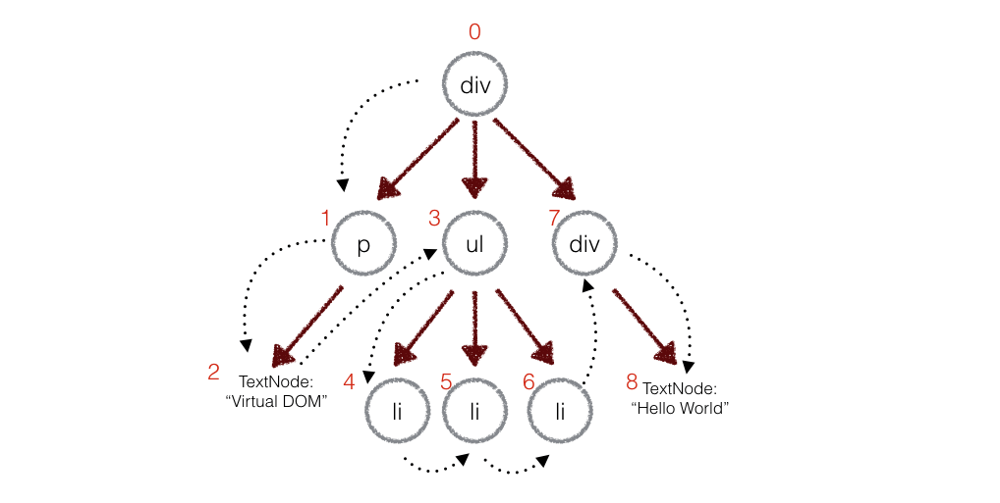

## 前言

早在react时期虚拟DOM就开始进入大家的视野，react是jsx语法，但虚拟DOM并不是和jsx语法强绑定的关系，vue在2.0版本的时候也引入了虚拟DOM，支持jsx和模板。那么虚拟DOM是什么，为什么主流的框架都使用它，它有哪些优点？

## 什么是虚拟DOM

虚拟DOM其实就是具有真实DOM标签、属性、嵌套结构的js树形数据，在对真实DOM操作前都会通过diff算法计算前后的改动，最后根据改动的js数据去一次性的修改DOM结构，以此解决传统js操作DOM带来的弊端

## 优点

* 跨平台： 虚拟DOM是js树结构，不限于浏览器DOM，同样适用于安卓、ios、小程序
* 高性能： 配合diff算法，减少js操作真实DOM带来的性能消耗

## 实现虚拟DOM

实现一个简单的虚拟DOM，我们大概需要三部分：

* element：创建虚拟DOM
* diff: 计算虚拟DOM的变化
* patch: 将虚拟DOM的变化更新到真实DOM中

### 生成DOM树

新建element.js，创建一个```Element```类，```Element```是生成虚拟DOM树的关键

```js
/**
 * @param tag dom标签
 * @param props dom属性
 * @param children 子节点
 */
class Element {
    constructor(tag, props, children) {
        // 存储标签、属性、子节点
        this.tag = tag; 
        this.props = props;
        this.children = children
        // 节点唯一标识
        if(props.key) { 
            this.key = props.key
        }
        // 添加子元素个数
        this.setCount(children)
    }
    setCount(children) {
        let count = 0;
        children && children.map((e, i)=>{
            if(e instanceof Element) {
                // 如果元素为节点，将子节点个数加上
                count += e.count
            } else {
                // 节点转化为字符串
                children[i] = e + ''
            }
            count++
        })
        this.count = count
    }
}

const createElement = (tag, props, children) => {
    return new Element(tag, props, children)
}
```

新建index.html，代码如下：

```html
<!doctype html>
<html>
<head>
    <title>Virtual Dom</title>
</head>
<script src="./element.js"></script>
<body>
</body>
<script>
    const data = createElement('ul', {}, [
        createElement('li', {}, ['aaa']),
        createElement('li', {}, ['bbb']),
        createElement('li', {}, ['ccc'])
    ])
    console.log('data', data)
</script>

</html>
```

打印```data```可以清晰的看到生成的js tree


接着我们需要将这部分数据渲染为真实的DOM，为```Element```类添加```render```方法

```js
class Element {
    // 添加到真实DOM中
    render() {
        const el = document.createElement(this.tag);
        // 设置属性
        Object.entries(this.props).map(([key, value])=> el.setAttribute(key, value) )
        const children = this.children || [];
        // 添加子节点
        children.map(e=> el.appendChild((e instanceof Element) ? e.render() : document.createTextNode(e)) )
        return el
    }
}
```

在index.html调用改方法

```js
const app = data.render()
console.log('app', app)
document.body.appendChild(app)
```

打印```app```及实际渲染效果：


这就是一个简单的虚拟DOM生成及渲染到浏览器的过程

### 对比虚拟DOM生成补丁

在对真实DOM改动之前会对新老虚拟DOM树进行对比然后生成补丁，对于两棵树的完全比较，```diff```算法的时间复杂程度为```O(n^3)```，但虚拟DOM很少有夸层级移动，所以我们只对同层级的元素进行对比，这样时间复杂度就变为```O(n)```，在网上找了一张图可以清晰的反应DOM对比过程


整个DOM树对比时会先进行深度优先遍历，并为每个节点添加唯一标识，如下图（请叫我盗图专家:smile::smile::smile:）：



了解这些后我们可以分析补丁可能有如下几种情况

* 文本内容变化
* 节点属性变化
* 节点被替换了
* 节点位置变了

如果节点位置变了，例如```p```、```span```、```a```顺序变为了```span```、```a```、```p```，如果按照同级顺序对比的话这些节点标签不一样将会被完全替换掉，这显然不是我们想要的，实际上只需要移动它们即可，这里借助```list-diff2```算法来帮助我们完成这一过程

大概聊一下```list-diff2```的实现，```diff```算法需要三个参数```oldList```、```newList```、```key```，其中```key```是非必填的，首先会遍历一遍旧数据，拿到一组集合也就是```children```，```children```是新旧数据都存在的子集并按照在旧数据中的顺序排列，子集没有的时候在```children```中为```null```，```list-diff2```源码通过```children.slice(0)```拷贝一份```children```得到```simulateList```（这个还蛮有意思的），遍历```simulateList```将为```null```的元素去掉并在```moves```中加入移除的元素的```index```和```type```，```type```为0表示移除，```type```为1表示插入。最后在遍历```newList```和```simulateList```中的个元素的```value```和```key```比较最终（这里还是有一些逻辑的建议去看看源码）得到完整的```moves```。大概就是这个样子，建议去看一下源码，加上注释空格也才100多行代码

经过一系列分析，下载[list-diff](https://github.com/livoras/list-diff/blob/master/lib/diff.js)并在index.html中引入，然后新建consts.js，添加如下常量

```js
const REPLACE = 0 // 替换节点
const REORDER = 1 // 插入节点
const PROPS = 2 // 修改属性
const TEXT = 3 // 文本改变
```

新建diff.js

```js
const diff = (oldData, newData) => {
    let index = 0; // 记录节点标识
    let patches = {}; // 记录各个节点变化(补丁)
    diffRun(oldData, newData, index, patches);
    return patches;
}

function diffRun(oldNode, newNode, index, patches) {
    let currentPatch = []; // 记录当前节点的补丁
    if (typeof oldNode === "string" && typeof newNode === "string") {
        // 文本不同，添加文本变化补丁
        oldNode !== newNode && currentPatch.push({ type: TEXT, content: newNode })
    } else if (newNode !== null && oldNode.tag === newNode.tag && oldNode.key === newNode.key) {
        // 节点相同，比较属性
        const propsPatches = diffProps(oldNode, newNode)
        // 属性存在差异，为节点添加属性变化补丁
        propsPatches && currentPatch.push({ type: PROPS, props: propsPatches })
        // 比较子节点
        diffChildren(
            oldNode.children,
            newNode.children,
            index,
            patches,
            currentPatch
        )
    } else if (newNode !== null) {
        // 节点不同且节点存在，为节点添加替换补丁
        currentPatch.push({ type: REPLACE, node: newNode })
    }
    
    if (currentPatch.length) {
        // 当前节点存在补丁，记录到对应标识位
        patches[index] = currentPatch
    }
}
// 新旧属性比较
function diffProps(oldNode, newNode) {
    let isHave = false;
    let propsPatch = {}
    const newProps = newNode.props;
    const oldProps = oldNode.props;
    // 遍历旧属性，如有新属性值不同的记录下来
    Object.keys(oldProps).map(e => {
        if (newProps[e] !== oldProps[e]) {
            propsPatch[e] = newProps[e]
            isHave = true
        }
    })
    // 遍历新属性，如旧属性没有新属性记录下来
    Object.keys(newProps).map(e => {
        if (!oldProps[e]) {
            propsPatch[e] = newProps[e]
            isHave = true
        }
    })
    if (isHave !== true) {
        return null
    }
    return propsPatch
}
// 子节点比较
function diffChildren(oldChildren, newChildren, index, patches, currentPatch) {
    // listdiff2 为list-diff2 算法，该算法的时间复杂度 O(n*m)
    // diffs.children 是新DOM树中含有的旧DOM树的数据，没有则为null
    // diffs.moves 是旧DOM各个节点的相应变动及新DOM中新增的节点的变动
    // 后续附上list-diff2源码分析
    var diffs = listdiff2(oldChildren, newChildren, 'key')
    newChildren = diffs.children // 旧DOM树中未删除的节点
    if (diffs.moves.length) {
        // moves存在子集，添加替换补丁
        var reorderPatch = { type: REORDER, moves: diffs.moves }
        currentPatch.push(reorderPatch)
    }
    var leftNode = null
    var currentNodeIndex = index
    // 深度遍历子节点
    oldChildren.forEach((child, i) => {
        var newChild = newChildren[i]
        currentNodeIndex = (leftNode && leftNode.count)
            ? currentNodeIndex + leftNode.count + 1
            : currentNodeIndex + 1
        diffRun(child, newChild, currentNodeIndex, patches)
        leftNode = child
    })
}
```

代码已经做了大量的注释，思路基本按照上述分析，我们就不在做过多的解释，将consts.js和diff.js引入index.html，尝试打补丁看一下

```js
const oldData = createElement('ul', { key: 'ul' }, [ // 标识  ul: 0
    createElement('li', {}, ['aaa']), //  li: 1    aaa: 2
    createElement('li', { }, ['bbb']), // li: 3    bbb: 4
    createElement('li', { }, ['ccc']) //  li: 5    ccc: 6
])
const newData = createElement('ul', { key: 'ul' }, [
    createElement('li', {}, ['aaa']),
    createElement('li', { }, ['aaa']),
    createElement('li', { }, ['bbb']),
    createElement('li', { }, ['ccc'])
])
const patches = diff(oldData, newData)
console.log('patches----------', patches)
```


根据```patches```结果，我们可以看出相应标识节点发生的变化，再来看一组数据

```js
const oldData = createElement('ul', { key: 'ul' }, [
    createElement('li', { key: 1 }, ['aaa']),
    createElement('li', { key: 2 }, ['bbb']),
    createElement('li', { key: 3 }, ['ccc'])
])
const newData = createElement('ul', { key: 'ul' }, [
    createElement('li', { key: 1 }, ['aaa']),
    createElement('li', { key: 4 }, ['aaa']),
    createElement('li', { key: 2 }, ['bbb']),
    createElement('li', { key: 3 }, ['ccc'])
])
const patches = diff(oldData, newData)
console.log('patches----------', patches)
```


这组数据的补丁似乎有所不同，原因是我们为节点加上了唯一标识```key```，此时```list-diff2```可以精确的追踪到每个节点的变化，而上个例子```li```具体有没有换过位置等一系列操作是无法追踪到的，另外从补丁可以看出添加```key```后对DOM的更新效率更高一点

到这里是不是可以想到```vue```为什么数组遍历的时候一定要加上```key```值了吗，因为对于动态DOM依赖```key```去追踪这些DOM的变化，并保证高效率的更新


### 打补丁

我们已经有了两次DOM树的补丁，那接下来就需要把补丁更新到真实DOM中去，新建patch.js

```js
const patch = (node, patches) => {
    let walker = {index: 0} // 记录索引
    patchRun(node, patches, walker)
}

function patchRun(node, patches, walker) {
    const currentPatches = patches[walker.index];
    const len = node.childNodes ? node.childNodes.length : 0;
    // 深度遍历子节点
    for(var i = 0; i < len; i++) {
        walker.index++;
        patchRun(node.childNodes[i], patches, walker)
    }
    // 存在补丁，及更新
    currentPatches && applyPatch(node, currentPatches)
}

function applyPatch(node, currentPatches) {
    currentPatches.map(currentPatch => {
        switch (currentPatch.type) {
            case REPLACE:
                const newNode = (typeof currentPatch.node === 'string')
                    ? document.createTextNode(currentPatch.node)
                    : currentPatch.node.render()
                node.parentNode.replaceChild(newNode, node)
                break;
            case REORDER:
                reorderChildren(node, currentPatch.moves)
                break;
            case PROPS:
                setProps(node, currentPatch.props)
                break;
            case TEXT:
                node.textContent = currentPatch.content
                break;
            default:
                throw new Error('Unknown patch type ' + currentPatch.type)
        }
    })
}
```

到此，已经粗略的了解了虚拟DOM

## 结语

充实自我，加油 ！！！

[完整代码](https://github.com/xwei111/virtual-dom-demo)

[演示地址](https://chasejourney.top/virtual-dom-demo/)

参考： [深入剖析：Vue核心之虚拟DOM](https://juejin.im/post/5d36cc575188257aea108a74#heading-6)


