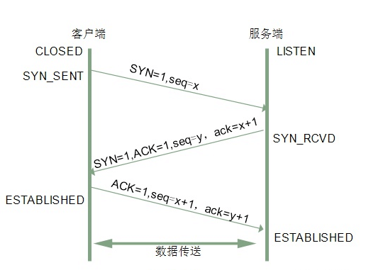
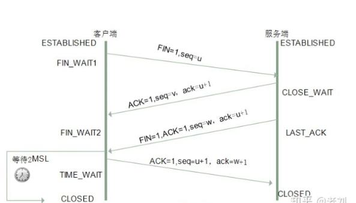

## 前言

解析完域名就拿到了ip地址，之后客户端就开始和服务端建立连接，之前我们提到过UDP和TCP，建立连接我们主要用到了TCP

## UDP和TCP区别

 
|       类别          |          UDP         |          TCP          |
|---------------------|----------------------|-----------------------|
|        连接         |       不需要连接     |       需要连接        | 
|        安全         |       尽量交付，不保证可靠       |       无差错，不丢失，不重复，且按序到达    |
|        效率         |           高         |          低            |
|      连接数量       |       一对一         |    一对一、一对多、多对一、多对多   |
|      系统要求       |       较高           |     较低    |
|      传输方式       |     面向报文         |      面向字节流      |
|      首部开销       |      仅8字节         |      最小20字节，最大60字节         |

TCP有握手、确认、窗口、重传、拥塞控制机制（遇到阻塞TCP会减少网络注入数据的速率和数量，缓解拥塞），是面向字节流的，UDP是面向数据报的，UDP更适合传输大量数据、交互通信、响应快、数据安全要求不高等场景。

## 三次握手

### 目的

TCP建立连接，需要三次握手，三次握手的目的有两个:

1. 保证服务端和客户端接收和发送能力
2. 指定自己的初始化序列号，为后面的可靠性做准备

### 标志位概念

TCP标志位基本概念：

1. SYN: synchronous建立联机
2. ACK: acknowledgement 确认
3. PSH: push传送
4. FIN: finish结束
5. RST: reset重置
6. URG: urgent紧急
7. seq: Sequence number顺序号码
8. ack: Acknowledge number确认号码

### 握手过程

* 第一次握手

客户端向服务端发送SYN报文并指明客户端初始化序列号ISN(c)，即发送SYN=1, seq=x到服务端，SYN报文不能携带参数(防止恶意携带大量参数)，服务端根据SYN=1知道客户端要建立连接，此时客户端进入SYN_SEND（同步已发送）状态

第一次握手确定了客户端的发送能力和服务端的接收能力（服务端确定了客户端的发送能力）

* 第二次握手

服务端已经知道了客户端要建立连接，于是也发送一个SYN报文，将客户端传过来的seq+1作为ack确认号码，同时初始化服务端序列号ISN(c)：seq=y，即发送SYN=1, ACK=1, seq=y, ack=x+1到客户端，服务端此时进入SYN_RCVD（同步收到）状态

第二次握手确定了服务端的发送能力和客户端的接收能力（客户端确定了服务端的发送和接收能力，但服务端还不知道客户端的接收能力）

* 第三次握手

客户端收到服务端的确认回复后，会发送一个ACK报文确认，将服务端发送过来的seq+1作为ack确认号，即发送AKC=1, ack=y+1, seq=x+1(第二次发送，所以+1)，此时客户端处于ESTABLISHED（建立连接）状态，待服务端收到报文后，服务端也处于ESTABLISHED状态，双方建立连接

第三次握手服务端确定了客户端的接收能力

### 为什么不能两次握手

其实我们从上述过程就已经可以知道两次握手服务端并不能确认服务端的接收能力，所以第三次握手是客户端向服务端发送ACK确认报文，一旦服务端确认了客户端的接收能力双方就可以建立连接

* 两次握手会造成什么问题？

问题一： 按两次握手的逻辑，A向B发送请求、B确认，这样即建立连接，B在向A传输数据过程中遇到网络问题A并未受到任何数据，过段时间A会认为B没有收到请求会再次发送请求，重复该动作，容易造成锁死

问题二： A向B发送请求，在某些网络结点长时间滞留了，A未收到确认报文，于是A再次向B发送一次连接请求，第一个请求在连接释放后才到达B，B会认为A发送了一个新的请求，于是向A发送确认，按照两次握手的逻辑，B发送确认即连接建立，但A并没有像B发送请求，不会理睬B的确认，于是B将一直处于等待状态，将浪费许多资源

### 是否可以携带参数

第一、二次握手不可携带参数，不可携带参数是防止频繁、恶意的在SYN携带大量参数，浪费服务器的空间、时间去接纳解析报文

第三次可以携带参数，第三次握手时客户端已经处于连接状态，并了解了服务端的发送接收能力，所以可以携带参数

## 四次挥手

数据传送完毕后就需要断开连接，TCP断开连接需要四次挥手（四次握手）

### 挥手过程

* 第一次挥手

客户端发送FIN报文，指定序列号seq=u，即FIN=1，seq=u此时客户端处于FIN_WAIT1（主动请求断开，终止等待）状态

* 第二次挥手

服务端收到终止连接请求后，发送ACK确认报文，把客户端seq+1作为确认号，即ACK=1，ack=u+1，seq=v，此时服务端处于CLOST_WAIT（等待关闭）状态，客户端收到确认报文后进入FIN_WAIT2状态

* 第三次挥手

等一段时间后服务端也想要断开连接，向客户端发送FIN报文，并指定序列号，即FIN=1，seq=w，ACK=1，ack=u+1，此时服务端处于LAST_ACK状态

* 第四次挥手

客户端收到服务端的断开请求后向服务端发送ACK确认报文，即ACK=1，ack=w+1，seq=u+1，此时客户端进入TIME_WAIT（时间等待或2MSL等待）状态，2MSL时间过后客户端将进入CLOSED（关闭）状态，服务端收到客户端确认报文后进入CLOSED状态

### 为什么要四次挥手

客户端向服务端发送终止请求后，服务端可以发出同意终止的报文，却可能不会立即关闭SOCKET，因为服务端可能还有数据没有发送完毕，等服务端数据发送完毕了，在向客户端发送FIN报文，所有第二次和第三次挥手需要分两步

### 2MSL等待状态

MSL是最长报文段寿命，它是任何报文在网络上存在的最长时间，超过这个时间报文将被丢弃。

客户端发送的最后一个ACK报文在传输过程中可能丢失，服务端如果没有收到这个报文会重复第三次挥手发送FIN-ACK报文，如果客户端这个时候已经处于关闭状态，那么服务端将再也无法收到客户端的ACK确认报文，所以客户端需要等待2MSL时间，超过这个时间没有收到服务端消息客户端会认为服务端已经关闭，然后进入关闭状态。

