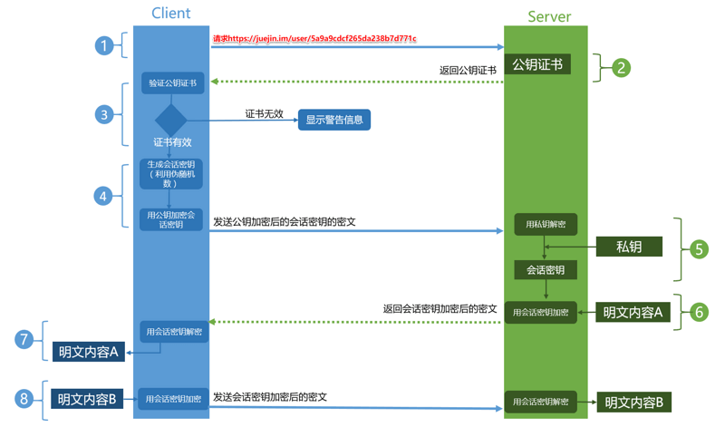

## 前言

HTTPS是现行架构下最安全的解决方案，虽然不是绝对安全，但它大幅增加了中间人攻击的成本

## HTTP、HTTPS区别

* HTTP是超文本传输协议，信息是明文传输的，HTTPS则是SSL + HTTP 协议构建的可进行加密传输、身份认证的网络协议
* HTTP与HTTPS连接方式不同，HTTP默认端口是80，HTTPS是443
* HTTPS使用了加密和身份认证，安全性更高
* HTTPS一般需要够买CA证书，费用比HTTP高
* 比起同等网站，HTTPS的搜索结果排名更高
* HTTPS握手阶段更复杂，使页面加载时间延迟50%，增加 10%~20% 的耗电

## HTTPS原理

* SSL

HTTPS协议主要功能都依赖于TSL/SSL协议，HTTP直接和TCP通信，而HTTPS是先和SSL通信，然后在由SSL和TCP通信，而加密和身份认证则都是在SSL阶段，所以我们常说HTTP + SSL就是HTTPS

* 加密

HTTPS加密使用了对称和非对称加密方式，对称加密(只有一个密钥)的好处就是解密比较快，但是安全性不高，一旦客户端的加密方法被知道了，服务端也就知道了，而非对称加密(两个密钥：公钥和私钥)的好处就是传输内容不能被破解(无法得到私钥)，对应的加密耗时就比较多，HTTPS充分利用两者的优缺点，在交换密钥环节使用非对称加密，建立通信后的报文阶段使用对称加密

* 身份认证

HTTPS的身份认证使用的是数字认证机(CA)及其颁发的数字证书，客户端接收到公钥时无法确定是由服务器的还是由其他谁的，所以使用第三方认证解决身份的问题保证数据未被篡改

客户端接收服务端传过来的公钥和证书后，使用CA公钥对证书解密获取网站信息和数字签名A，然后根据CA签名规则生成数字签名B，对比A和B，不匹配则证书无效

证书中的网站信息不正确证书也无效(内容被篡改)

* 通信

1. 客户端使用HTTPS访问服务器，服务器将准备好的证书(包含公钥)返回给客户端
2. 客户端验证证书的是否有效，无效向服务器发送警告，询问是否可以继续使用
3. 如果有效，客户端使用公钥加密一个随机对称密钥，发送给服务端
4. 服务端使用私钥解密浏览器发送的密钥
5. 服务端使用对称密钥加密内容发送给客户端
6. 客户端使用对称密钥解密响应的密文，得到被加密的内容
7. 重复步骤5、6

盗个图：

## 使用HTTPS的目的

了解了前边内容这个就好说多了：

1. 对明文传输的内容加密
2. 验证通信双方的身份
3. 确保传输内容不被篡改

参考：

[深入理解HTTPS工作原理](https://segmentfault.com/a/1190000018992153)
[jsliang 求职系列 - 29 - HTTP/HTTPS](https://juejin.cn/post/6901070996732641294#heading-29)

## 结语

年底了......可能回不去了:cry:
