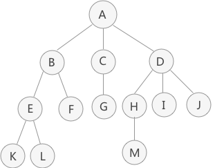
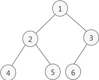
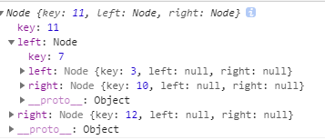
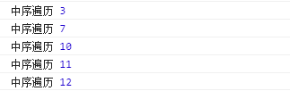
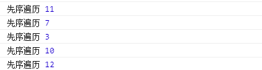

## 前言

请假回了趟家，回来继续认真的工作、学习

## 数据扁平化

<span style="color: #E6A23C;">先介绍一个实际开发时对树形数据的优化——数据扁平化，这是一个比较实用的方法，但仍需根据实际需求灵活处理</span>

树是一个层级的结构，对树节点的查询需要递归查询，直到找到对应的节点，而这样的频繁查找是相当耗性能的，这时候我们可以对树做扁平化的处理，以下边一组数据为例：

```js
let tree = [
  {
    id: '1',
    name: 'a',
    children: [
      {
        id: '1-1',
        name: 'a-1',
        arr: [1]
      }
    ]
  },
  {
    id: '2',
    name: 'b',
    children: [
      {
        id: '2-1',
        name: 'b-1'
      }, {
        id: '2-2',
        name: 'b-2'
      }
    ]
  }
]
```

我们将上边数据做一下扁平化处理：

```js
let flatTree = {};
const getFlatTree = (tree, parent) => {
  tree.forEach((item) => {
    flatTree[item.id] = item;
    flatTree[item.id].parent = parent
    if (item.children) {
      getFlatTree(item.children, item)
    }
  })
}
getFlatTree(tree, null)
console.log(flatTree)
// 打印结果
// {
//   1: {id: "1", name: "a", children: Array(1), parent: null}
//   1-1: {id: "1-1", name: "a-1", arr: Array(1), parent: {…}}
//   2: {id: "2", name: "b", children: Array(2), parent: null}
//   2-1: {id: "2-1", name: "b-1", parent: {…}}
//   2-2: {id: "2-2", name: "b-2", parent: {…}}
// }
```

可以看到处理后的树变成一个对象，该对象包含了树所有节点，查询变得相当容易，另外任何一个节点上都包含了树整条线上的数据（可以根据实际业务做相应处理），后续查询、修改等操作均可操作处理后的数据，避免一次次递归的耗性能操作，不举更多例子，建议灵活使用

## 树

接下来，一起详细的了解一下树

### 基础概念

先来了解关于树的一些概念，以下图为例



* 结点

1. 树中每个元素都是一个节点，例：A、B、C、D、E、F、K、L、M
2. 根结点只有一个，根结点无父结点，例：A
3. 父结点、子结点、兄弟结点都是相对而言，例：A是B的父结点(B是A的子结点)、B是E的父结点、B和C互为兄弟结点
4. 没有子结点的即为叶子结点，例：K、L、F、M、G、I、J

* 结点度和层次

1. 度指的是结点的子结点个数，有几个子结点度就是几，例：A的度为3、B的度为2
2. 根结点为第一层，以此类推D是第二层、H为第三层

* 有序树、无序树

1. 有序树指的是从左到右按规律摆放的树，最左侧第一个子树称之为"第一个孩子"，最右侧的称之为"最后一个孩子"，若上图为有序树，则以B为根结点的子树为整棵树的第一个孩子，以D为根结点的子树为整颗树的最后一个孩子
2. 非有序树则为无序树

### 二叉树

二叉树有两个特点：

1. 二叉树是有序树
2. 二叉树各个结点的度不超过2

二叉树又分为满二叉树和完全二叉树：

1. 满二叉树是结点(除叶子结点)的度均为2且叶子结点在同一层级，如下：


2. 完全二叉树除了最后一层之外的为满二叉树，且从左到右依次排列，如下：



## 实现二叉搜索树

实现二叉搜索树的基本原则就是左侧存放比父结点小的、右侧存放比父结点大的，接下来就是代码时刻，首先实现一个节点类：

```js
class Node {
  constructor(key) {
    this.key = key; // 存放节点数据
    this.left = null; // 存放小于节点数据
    this.right = null; // 存放大于节点数据
  }
}
```

接着写一个简单的二叉搜索树的类

### 插入

```js
class BinarySearchTree {
  constructor() {
    this.root = null;
  }
  insert(key) {
    const newNode = new Node(key);
    const insertNode = (node, newNode) => {
      if (newNode.key < node.key) {
        if (node.left === null) {
          node.left = newNode
        } else {
          // 结点存在，继续向下插入
          insertNode(node.left, newNode)
        }
      } else {
        if (node.right === null) {
          node.right = newNode
        } else {
          insertNode(node.right, newNode)
        }
      }
    }
    if (!this.root) {
      // 根结点首次赋值
      this.root = newNode;
    } else {
      // 插入子结点
      insertNode(this.root, newNode)
    }
  }
}
```

初步实现了二叉树的插入，尝试一下看看：

```js
const tree = new BinarySearchTree();
tree.insert(11)
tree.insert(7)
tree.insert(12)
tree.insert(3)
tree.insert(10)
console.log(tree.root)
```

结果还是符合我们的预期的，如下：



接下来实现一下树的深度优先遍历，深度优先遍历有三种方法，一起看一下

### 中序遍历

```js
// 中序遍历是一种以从最小到最大的顺序访问所有节点
inOrderTraverse(callback) {
  const inOrderTraverseNode = (node, callback) => {
      if (node !== null) {
          inOrderTraverseNode(node.left, callback)
          callback(node.key)
          inOrderTraverseNode(node.right, callback)
      }
  }
  inOrderTraverseNode(this.root, callback)
}

tree.inOrderTraverse((value)=>console.log('中序遍历',value))
```

执行结果如下：



### 先序遍历

```js
// 先序遍历是以优先于后代节点的顺序访问每个节点的。先序遍历的一种应用是打印一个结构化的文档。
preOrderTraverse(callback) {
  const preOrderTraverseNode = (node, callback) => {
    if (node !== null) {
      callback(node.key)
      preOrderTraverseNode(node.left, callback)
      preOrderTraverseNode(node.right, callback)
    }
  }
  preOrderTraverseNode(this.root, callback)
}

tree.preOrderTraverse((value)=>console.log('先序遍历',value))
```

执行结果如下：



### 后续遍历

```js
// 后序遍历则是先访问节点的后代节点，再访问节点本身。后序遍历的一种应用是计算一个目录和它的子目录中所有文件所占空间的大小。
postOrderTraverse(callback) {
  const postOrderTraverseNode = (node, callback) => {
    if (node !== null) {
      postOrderTraverseNode(node.left, callback)
      postOrderTraverseNode(node.right, callback)
      callback(node.key)
    }
  }
  postOrderTraverseNode(this.root, callback)
}

tree.postOrderTraverse((value) => console.log('后序遍历', value))
```

### 广度优先遍历

```js
orderByLevel(callback) {
  const { root } = this;
  if(!root) return
  let queue = [ root ];
  while(queue.length) {
    let level = queue.length;
    for(let i = 0; i < level; i++ ) {
      const current = queue.shift()
      callback(current.key);
      current.left ? queue.push(current.left) : '';
      current.right ? queue.push(current.right) : '';
    }
  }
}
```

### 查询

```js
// 查询最小值
min(node) {
  const minNode = node => node ? (node.left ? minNode(node.left) : node) : null;
  return minNode(node || this.root)
}
// 查询最大值
max(node) {
  const maxNode = node => node ? (node.right ? maxNode(node.right) : node) : null;
  return maxNode(node || this.root)
}
// 搜索一个特定的值
search(key) {
  const searchNode = (node, key) => {
    if (node === null) return false
    if (node.key === key) return node
    return searchNode((key < node.key) ? node.left : node.right, key)
  }
  return searchNode(this.root, key)
}
```

### 移除

```js
remove(key) {
  const removeNode = (node, key) => {
    if (node === null) { return null }
    if (key < node.key) {
      node.left = removeNode(node.left, key);
      return node;
    } else if (key > node.key) {
      node.right = removeNode(node.right, key);
      return node;
    } else {
      if (node.left == null && node.right == null) {
        // 无子结点，完全移除自身
        node = null;
        return node;
      }
      if (node.left == null) {
        // 左侧无结点，取右侧结点
        node = node.right;
        return node;
      } else if (node.right == null) {
        // 右侧无结点，取左侧结点
        node = node.left;
        return node;
      }
      // 找到该结点右侧最小值并将该值赋值到要移除结点
      var aux = this.findMinNode(node.right);
      node.key = aux.key;
      // 移除aux
      node.right = removeNode(node.right, aux.key);
      return node;
    }
  }
  return removeNode(this.root, key)
}
// 找到右侧最小的节点
findMinNode(node) {
  while (node && node.left !== null) {
    node = node.left;
  }
  return node;
}
```

### 完整代码

```js
class Node {
  constructor(key) {
    this.key = key;
    this.left = null;
    this.right = null;
  }
}
class BinarySearchTree {
  constructor() {
    this.root = null;
  }
  insert(key) {
    const newNode = new Node(key);
    const insertNode = (node, newNode) => {
      if (newNode.key < node.key) {
        if (node.left === null) {
          node.left = newNode
        } else {
          insertNode(node.left, newNode)
        }
      } else {
        if (node.right === null) {
          node.right = newNode
        } else {
          insertNode(node.right, newNode)
        }
      }
    }
    if (!this.root) {
      this.root = newNode;
    } else {
      insertNode(this.root, newNode)
    }
  }
  // 中序遍历是一种以从最小到最大的顺序访问所有节点
  inOrderTraverse(callback) {
    const inOrderTraverseNode = (node, callback) => {
      if (node !== null) {
        inOrderTraverseNode(node.left, callback)
        callback(node.key)
        inOrderTraverseNode(node.right, callback)
      }
    }
    inOrderTraverseNode(this.root, callback)
  }
  //先序遍历  先序遍历是以优先于后代节点的顺序访问每个节点的。先序遍历的一种应用是打印一个结构化的文档。
  preOrderTraverse(callback) {
    const preOrderTraverseNode = (node, callback) => {
      if (node !== null) {
        callback(node.key)
        preOrderTraverseNode(node.left, callback)
        preOrderTraverseNode(node.right, callback)
      }
    }
    preOrderTraverseNode(this.root, callback)
  }
  // 后序遍历  后序遍历则是先访问节点的后代节点，再访问节点本身。后序遍历的一种应用是计算一个目录和它的子目录中所有文件所占空间的大小。
  postOrderTraverse(callback) {
    const postOrderTraverseNode = (node, callback) => {
      if (node !== null) {
        postOrderTraverseNode(node.left, callback)
        postOrderTraverseNode(node.right, callback)
        callback(node.key)
      }
    }
    postOrderTraverseNode(this.root, callback)
  }
  orderByLevel(callback) {
    const { root } = this;
    if(!root) return
    let queue = [ root ];
    while(queue.length) {
      let level = queue.length;
      for(let i = 0; i < level; i++ ) {
        const current = queue.shift()
        callback(current.key);
        current.left ? queue.push(current.left) : '';
        current.right ? queue.push(current.right) : '';
      }
    }
  }
  // 查询最小值
  min(node) {
    const minNode = node => node ? (node.left ? minNode(node.left) : node) : null;
    return minNode(node || this.root)
  }
  // 查询最大值
  max(node) {
    const maxNode = node => node ? (node.right ? maxNode(node.right) : node) : null;
    return maxNode(node || this.root)
  }
  // 搜索一个特定的值
  search(key) {
    const searchNode = (node, key) => {
      if (node === null) return false
      if (node.key === key) return node
      return searchNode((key < node.key) ? node.left : node.right, key)
    }
    return searchNode(this.root, key)
  }
  // 移除一个节点
  remove(key) {
    const removeNode = (node, key) => {
      if (node === null) { return null }
      if (key < node.key) {
        node.left = removeNode(node.left, key);
        return node;
      } else if (key > node.key) {
        node.right = removeNode(node.right, key);
        return node;
      } else {
        if (node.left == null && node.right == null) {
          // 无子结点，完全移除自身
          node = null;
          return node;
        }
        if (node.left == null) {
          // 左侧无结点，取右侧结点
          node = node.right;
          return node;
        } else if (node.right == null) {
          // 右侧无结点，取左侧结点
          node = node.left;
          return node;
        }
        // 找到该结点右侧最小值并将该值赋值到要移除结点
        var aux = this.findMinNode(node.right);
        node.key = aux.key;
        // 移除aux
        node.right = removeNode(node.right, aux.key);
        return node;
      }
    }
    return removeNode(this.root, key)
  }
  // 找到右侧最小的节点
  findMinNode(node) {
    while (node && node.left !== null) {
      node = node.left;
    }
    return node;
  }
}
```

## 结语

未完待续...
