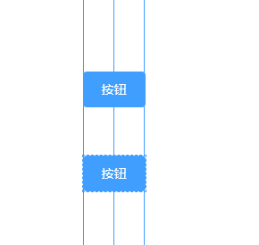
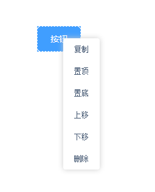
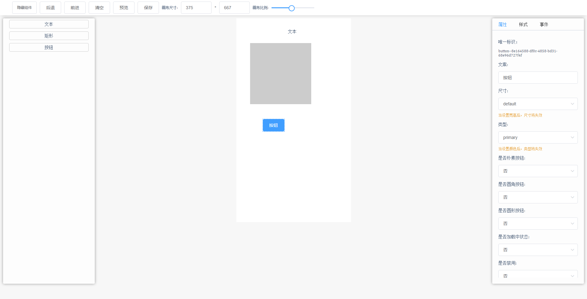

[github](https://github.com/xwei111/lesscode)

[演示地址](https://chasejourney.top/lesscode-show/#/)

## 前言

用了四天时间做了一个低代码平台的demo，分享一下目前了解到的东西，主要分享一下核心的内容

## 画布

虽然这里称之为画布，但并不是```canvas```，而是一个```div```盒子，所有元素都会展现在此画布中，画布具有一定的功能：

### 设置画布大小

这个比较简单，通过输入的动态改变画布```width```和```height```即可，方式很多，此功能主要是对为了适配pc&移动端

### 缩放

通过```scale```动态设置即可

### 承载托拉拽元素

1. 拉取元素至画布指定定置

拖动元素元素涉及到```draggable```、```dragstart```、```dragover```和```drop```等属性方法，并通过```dataTransfer```来记录拖动元素，```drop```时通```dataTransfer```获取拖动元素数据，并记录鼠标位置，此位置即使放下后元素在画布的位置

2. 拖动画布 & 拖动元素

拖动画布和元素均是通过```mousedown```和```mouseup```，元素拖动添加```stop```修饰器防止触发画布事件

## 标线



标线逻辑代码均在```store/modules/linesMoudles.ts```中

### 六条标线

六条标线即：

1. x轴上侧
2. x轴中部
3. x轴下侧
4. y轴右侧
5. y轴中部
6. y轴左侧

当两个元素在x和y轴某一侧或中部在一条线上是显示一个标准水平线

### 吸附

当两个元素足够近时（我们设置的是3px），将移动的元素的位置动态设置为靠近的元素，像是被吸附过去一样


## 自定义右键菜单



菜单逻辑代码在```hooks/useCustomMenu.ts```

右键菜单功能如下：

1. 复制
2. 置顶
3. 置底
4. 上移
5. 下移
6. 删除

介绍这些功能先说一下低代码平台的本质就是操控数据，你所看到的一切元素都是数据通过处理后渲染为相应的元素，所以右键菜单的功能也就是对数据的操作，```复制```就介绍了就是copy一份数据，这里介绍一下```上移```、```下移```的操作


所有元素都会被一个```div```盒子包裹，所有添加的元素都通过```push```操作添加到数组中去，所有元素都有一个索引，将索引设置为元素的层级：、

```js
// z-index即为元素的层级
<div
  class="el-wraper"
  v-for="(item, index) in state.components"
  :key="item.uuid"
  :style="`${getWraperStl(item.style)}z-index: ${index + 1};`"
>
  <component
    style="position: static"
    :data="item"
    :id="item.uuid"
    :is="item.template"
    :attr="item.attr"
    :style="`${getStl(item.style)}`"
    :events="item.events"
  ></component>
</div>
```

知道了元素的层级关系，就可以通过操作数据在数据中的位置即可调整层级，```置顶```、```置底```原理相同

## 前进、后退、清空 

逻辑代码在```hooks/useAction.ts```

所谓```后退```就是```撤销```操作，要实现这个功能需要记录用户所有动作快照，所谓动作快照就是任何会改变元素数据的操作，如添加行的元素、拖动元素在画布上移动、改变了元素大小等等操作


使用```actionIndex```来记录用户操作次数、```actionComs```记录用户每次操作快照，前进时```actionIndex+1```，后退则```actionIndex-1```，根据```actionIndex```获取```actionComs```中对应的快照数据


这里需要注意的是在后退时也可能会有新的快照操作，如后退三步后添加一个新的元素，那就生成了新的快照，这里有两种做法：

1. 插入新的快照
2. 新的快照覆盖之前已经撤销的动作

这里采用第二种方案，也就是说一旦撤销后有了新的快照生成，已经撤销的快照则会丢掉

## 自定义组件

组件代码在```src/customComs```

开头没有说元素时怎样添加的，这里一并介绍了。

无论是自己开发还是借用已有的组件库都需要自定一份组件来接收我们需要设置的属性、样式、事件等（代码有demo可看），然后将组件全局注册，后通过```component```的```is```属性接收，这里稍微介绍一下```vue3.0```组件的全局注册，如下：

```js
// customEl.ts
import customButton from "@/customComs/custom-button/index.vue";

const install = (app: any): void => {
  app.component("customButton", customButton);
};

export default install;

// main.ts
import { createApp } from "vue";
const app = createApp(App);
install(app);
app.use(store).use(router).use(ElementPlus).mount("#app");
```

之后通过数据```template```匹配即可

```js
<div
  class="el-wraper"
  v-for="(item, index) in state.components"
  :key="item.uuid"
  :style="`${getWraperStl(item.style)}z-index: ${index + 1};`"
>
  <component
    style="position: static"
    :data="item"
    :id="item.uuid"
    :is="item.template"
    :attr="item.attr"
    :style="`${getStl(item.style)}`"
    :events="item.events"
  ></component>
</div>
```

## 属性、样式

添加每个组件数据时会生成一个唯一id：```uuid```，这个```uuid```是元素的唯一凭证，我们也是凭借```uuid```修改对应元素的属性和样式，其实这里没什么可说的，可以有什么样的属性和样式完全看自定义的组件支持什么，能多复杂就有多复杂能有多简单也就有多简单

## 事件

单说静态的平台的话，我觉得是事件是最麻烦的，也很难去适配各个场景，只能尽量去完善，因为是低代码平台，所以尽量不会让用户在平台上手写代码，所以很多低代码更多的是愿意去做移动的、海报类的、少逻辑的的一些页面

举个很实际的例子，2020年疫情爆发时，浙江政府需要快速做一套疫情管控系统，阿里同学使用[宜搭](https://www.aliwork.com/)搭了一套简易版的，但随着需求的复杂度的提升，这样的平台根本无法满足需求，全部推翻重新撸了一遍

继续介绍事件，为什么说这块复杂呢，先说一下它的场景：

事件可以分为（部分罗列）：

1. click
2. mouseover
3. mouseenter
4. mousedown
5. mouseup
6. onmouseout
7. ondblclick
8. onresize
9. 键盘事件
10. 鼠标事件

click事件分类（部分罗列）：

1. url跳转
2. api请求，请求成功/失败回调
3. 对其他元素的影响、包括全局
4. 是否有反向操作
5. 表单提交
6. 自定义逻辑

因为情况很多，业务场景复杂度亦不可预期，所以除了一些通用得可以去实现，而且还要看可以完成的程度，其余的更多需要开发人员去自定事件，对于不了解代码的也很难完成

这里制作了一个改变其他元素属性的点击事件的demo供参考（代码在```views/attr/setEvent```），做完事件这个个人认为一个好的功能全的低代码平台还是非常复杂且难的（也可能是自己的理解不够，望指正）

## 预览

编辑过程中是无法看到逻辑的，需要切换到预览模式下

## 其它

做的比较简单，生成代码、提交git、快速部署等功能还未设计，一般有后台的话也会有跟多类似保存、暂存的功能，其实就是将数据保存在后台，页面的生成依赖数据，不多说了，有时间了可以瞄瞄，最后看一下整体效果




