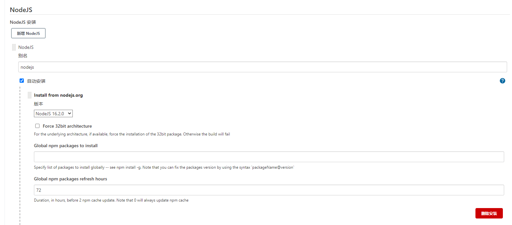
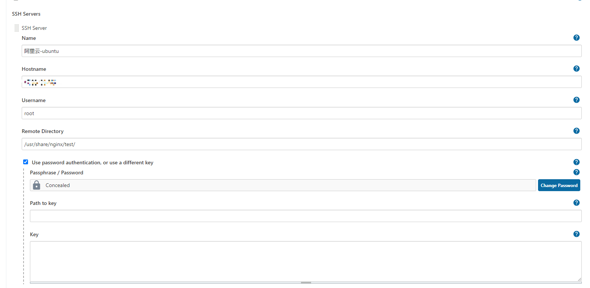
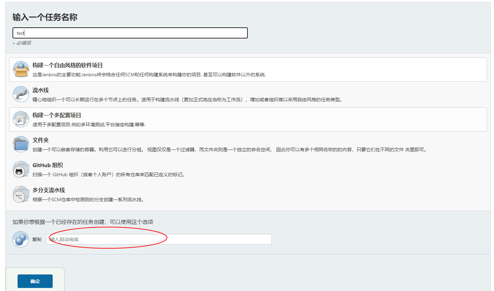
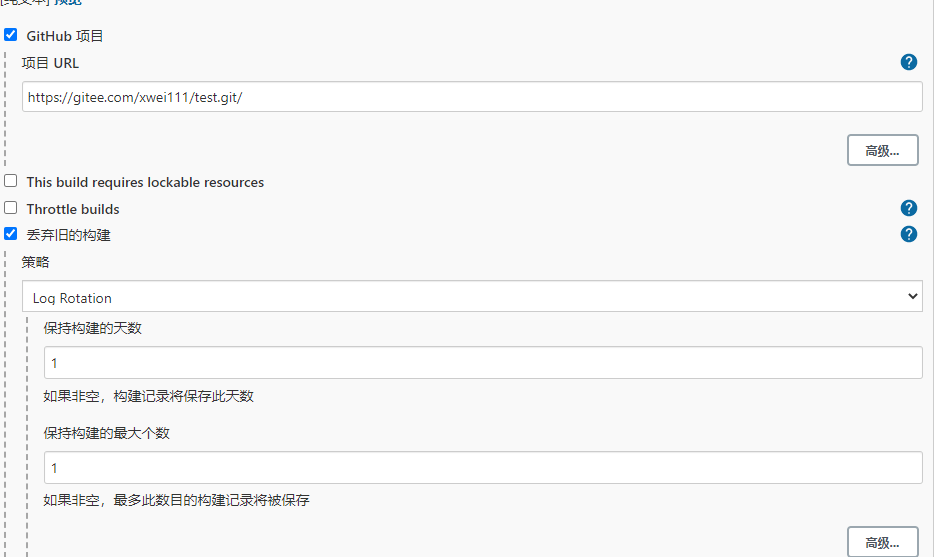
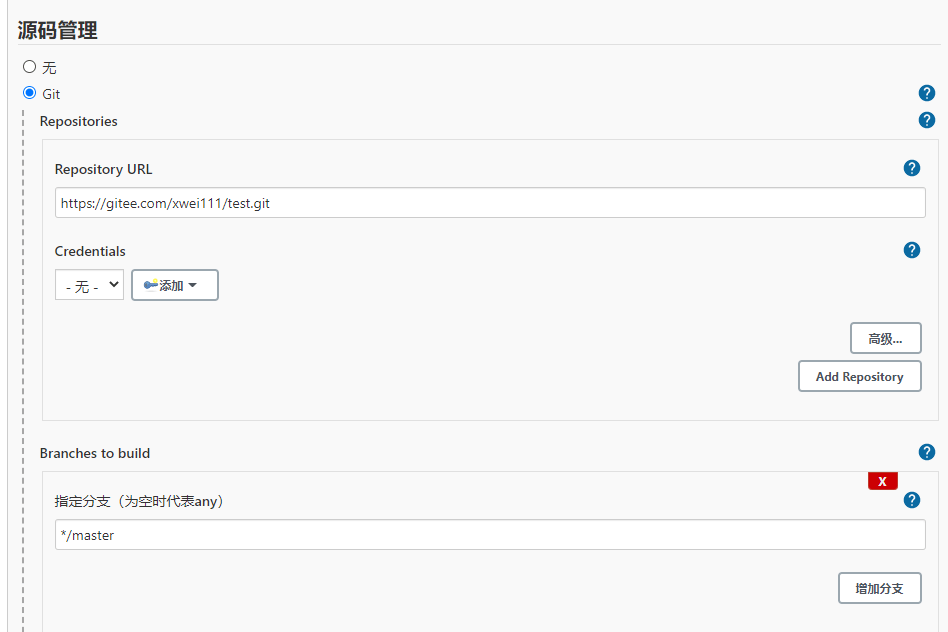
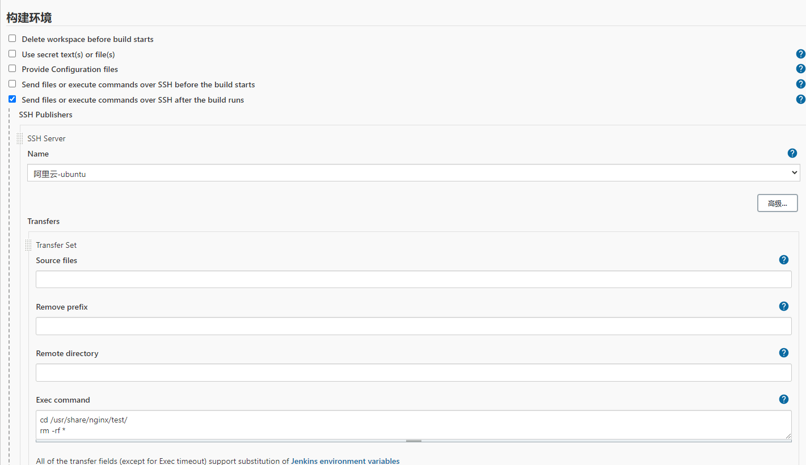
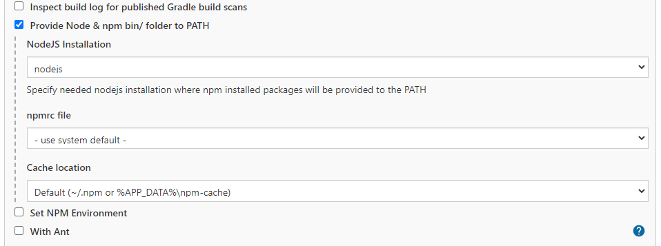
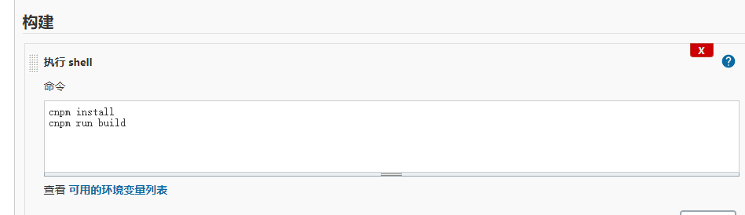
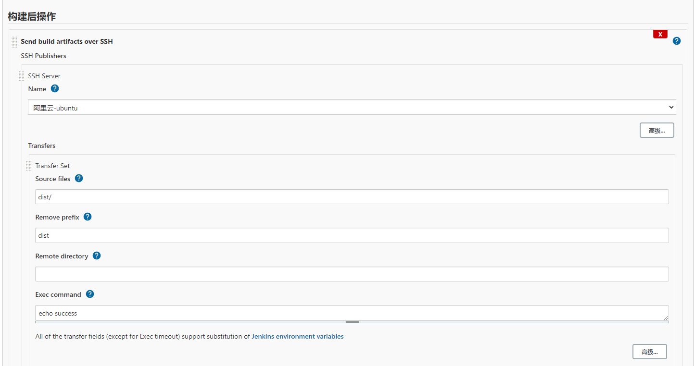

## 前言

追旅初入前端时公司还是用```ftp```工具去部署项目，用的最熟练的命令就是```rm -rf```和```cp```，现在看来自己当时还处于```冷兵器```时代，还傻傻的不自知。在之后的公司，除了部署方式不同，大多都开始使用```jenkins```去部署项目了，而随着前端工程化的深入人心，部署也已经是前端同学的必备技能，还真是学到老活到老，作为技术人还是要有技术人的觉悟的

## Github Actions

```actions```是```github```19年11月正式推出的```CI/CD```服务，追旅的博客也是通过```actions```实现自动化部署到```github```的，而```actions```与其他部署相比较大的优点就是不需要使用者再去书写复杂的脚本，可以引用其他开发者已有的```actions```就可以了

### 基本术语

```GitHub Actions```基本术语：

* workflow

持续集成一次运行的过程，就是一个 workflow

* job 

一个 workflow 由一个或多个 jobs 构成，含义是一次持续集成的运行，可以完成多个任务

* step

每个 job 由多个 step 构成，一步步完成

* action

每个 step 可以依次执行一个或多个命令（action）

### yml文件

```GitHub Actions```执行的脚本是```yml```文件，位置在```.github/workflow```下

通常有两种配置方式：

1. 通过github上的Actions选项直接配置，在github上配置完会直接commit一次，所以我们必须pull一次代码

2. 在本地工程里边新建```.github\workflows\main.yml```，在```main.yml```中配置ok后提交代码就可以了

### 配置

这里以一份部署到```GitHub Pages```的配置为```demo```加上注释给大家看一下，```GitHub Pages```配置入口：```settings=>GitHub Pages```

```yml
# workflow名称，命名一个自己看得懂的即可
name: Publish page
# on 是监听触发的动作，这里监听push代码的动作，触发部署
# branches 代表的是分支，还可以配置tag和paths，或者配置branches-ignore、tags-ignore  、paths-ignore忽略分支、tag等
on:
  push:
    branches:
      - master
      
# schedule 可以配置schedule来定时触发部署，需要去了解一下cron表达式，这里选择手动部署

# jobs 是我们将要做的事情
# 建立一个名为build-and-deploy的job
# runs-on 指定依赖的虚拟环境为ubuntu-latest
# steps 下边开始各个步骤
# name: Checkout 检索代码
# 使用其他开发者的action:  actions/checkout@v2 
# name: Install and Build 开始安装环境并打包
# name: Deploy 开始部署，同样使用其他作者的现有action
# width BRANCH 需要部署的分支：BRANCH
# with FOLDER 需要部署的文件(即打包后的资源) blog/.vuepress/dist
jobs:
  build-and-deploy:
    runs-on: ubuntu-latest
    steps:
      - name: Checkout
        uses: actions/checkout@v2 
        with:
          persist-credentials: false

      - name: Install and Build 
        run: |
          npm install
          npm run build
      - name: Deploy 
        uses: JamesIves/github-pages-deploy-action@releases/v3
        with:
          GITHUB_TOKEN: ${{ secrets.GITHUB_TOKEN }}
          BRANCH: gh-pages
          FOLDER: blog/.vuepress/dist
```

可以看到```GitHub Actions```的部署方式相当的简单，很多关键地方可以使用现成的```action```，大大的降低的部署的成本，线上部署进度到```Github Actions```查看

## Jenkins & nginx

大家可以先到[阿里云](https://www.aliyun.com/daily-act/ecs/free?utm_content=se_1009187272)注册一个免费的服务器，大概有1-12月的样子，足够我们去做一些尝试了，不过配置过程的相当的痛苦（小白表示各种配置以及权限的问题，真滴能把人搞死了，说到底还是太弱了），追旅虚拟机用的是```ubuntu```,阿里云提供了多种链接虚拟机的方式，打击可以试一下，追旅也推荐一款连接服务器的工具[mobaxterm](https://mobaxterm.mobatek.net/)，下边是阿里云提供的方式


使用阿里云```ssh```链接遇到问题时的几种处理方式:

1. 到安全组中开启端口，例如```ssh```的端口默认为```22```
2. 到```/etc/ssh/sshd_config```中看一下```PermitRootLogin```配置是否为```yes```并且注释关闭（#号删掉）
3. ```ssh```无法链接，可以查看是否启动了```ssh```服务

其他的小问题不说了，更多问题自行查找吧

### nginx

```js
// 安装 nginx
apt-get install nginx
// 启动
service nginx start
// 停止
service nginx stop
// 重启
service nginx restart
```

简单配置一下```nginx```，接下来作为我们测试项目的部署地址，配置文件在```/etc/nginx/nginx.conf```，添加如下配置：

```
server {
  listen  8000;
  server_name  localhost;
  location / {
    root  test;
    index  index.html index.htm;
    try_files $uri $uri/ /index.html; // 对于history路由的配置
  }
  // 配置反向代理，以/lesscode/开头的请求指向http://47.98.126.233:3000
  location ^~/lesscode/ {
    proxy_pass http://47.98.126.233:3000;
  }
}
```

前端静态资源的部署地址是```/usr/share/nginx/```，可以自行创建```test```文件夹，并添加一个```html```页面看一下是否可以访问

```nginx```更多配置不在介绍，目前基本满足了我们自动化部署测试的需求，```nginx```很强大，追旅之后专门做一期的分享

### jenkins

```jenkins```的安装启动方式和```nginx```一样，初始化```jenkins```不说了，假设我们现在以及启动了```jenkins```，接下来除了默认安装的插件外，需要额外安装两个插件：```NodeJS Plugin``` 和 ```Publish Over SSH```，一个是用来配置```node```环境，一个是用来连接远程服务，记得装完插件要重启```jenkins```服务

```jenkins```依赖```java```，阿里云的服务器没有```java```环境，记得自行安装一下

#### node

```node```的配置入口在```全局工具配置```，选择自己需要的```node```版本，```node```版本要和虚拟机安装的```node```保持一致



#### ssh

```ssh```配置入口在```系统配置```



* name: 定义一个名称
* Hostname：服务器地址
* Username：登录用户
* Remote Directory：远程部署地址
* Passphrase / Password： 填写用户密码

填完这些保存即可

#### 创建项目

起一个名称，选择一个自由风格的软件项目，当你有一个相同配置的项目时可以在下方复制那里输入项目名称，确定后会带出相同的配置



进入项目的配置，填写项目的名称，关联```git```地址，因为```github```网络不稳定，经常失败，这里选择了```码云```



指定分支



我们这里选择手动触发，然后为了保证服务器上码云冗余的资源及资源是最新的，我们选择打包后、部署前删除上次部署在```nginx```的资
源




选择之前配置的```node```



编写打包脚本，这里使用```cnpm```



最后配置打包部署的操作，打包后的文件是```dist```，并且我们只需要部署```dist```中的内容



基本到此，整个部署基本完成了，完事访问我们```nginx```配置的```8000```端口即可：[访问地址](http://47.98.126.233:8000/)

## 结语

完成一次简单的部署并不麻烦，但是从头搭一套还是蛮累的，因为在自己不熟悉的领域搞事情啥都得边查边搞，而且有些不知名的错误，但前端发展这么快，或者说技术发展这么快，不拓展自己的技术领域又能在技术路上走多久呢，一直做一些熟悉的事情，好像也会很无聊吧