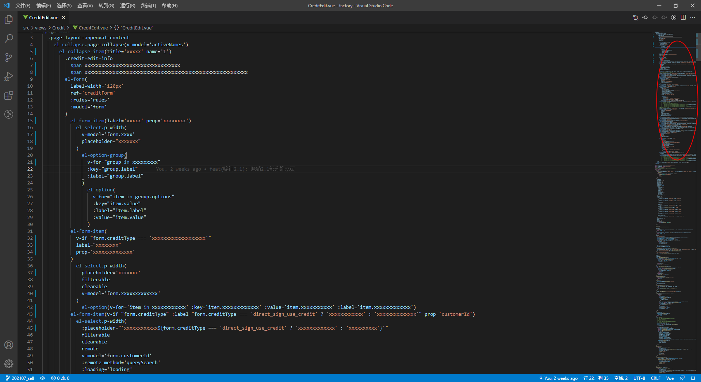
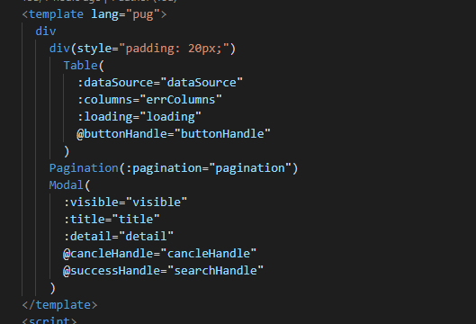

## 前言

分享一下最近项目的实践，尽量讲清楚吧，主要还是传递组件化、模块化、解耦、聚合这些思想。思想是基础，实践得真理

## 前端开发现状

前端从原始社会```js```、```JQuery```，发展到现在有了很多优秀的工具和框架，如：```webpack```、```gulp```、```parcle```、```vue-cli```、```react```脚手架、```umijs```等等以及可以让我们轻松的一键搭起一套项目的基础框架，然后配套着```element-ui```、```antd```等ui库可以实现快速的开发，```天时```、```地利```都已然具备了，接下来就是```人和```，谈一下追旅发现的一些问题（仅代表个人观点）

1. 使用了组件化、模块化框架开发，开发出的代码依然难维护，有组件化、模块化的形，没有组件化、模块化的实
2. 缺少解耦思想，殊不知没有解耦则没有聚合。先编码再去做拆解，这个过程本身就是错误，不能以```后期优化```这个借口作为兜底
3. 封装的组件换个场景、项目或场景丰富的情况下无法使用，一次次的封装
4. 逻辑难以复用，除了工具类，涉及业务逻辑难以抽离或缺失灵活度(现有技术瓶颈)
5. 逻辑层 & UI层强耦合，随着功能模块增加，逻辑层 & UI层代码量增加变得难以维护，通用逻辑无法复用
6. 开发者：你已经是个成熟的编辑器了，要学会自己编码了。        编辑器：卒

更实际的问题是逻辑层非常灵活，开发人员编码能力不同，```eslint```、```tslint```只能作为语法、编码风格检查工具变的鸡肋，最终结果就是项目越大越难以维护

## 搞事情

说了那么多问题，感觉好像一个怨妇，既然知道了问题就得思考一下如何做解决这一系列的问题，提升个人开发效率并让团队从中受益

接下来说的也是前端团队小伙伴们已经在做的事情，从本质上解决项目维护性、逻辑复用性的问题，甚至可以达到一劳永逸的效果（不管主动还是被动的都感谢了）

### 业务层

前端开发较为直观，原型图作为参考可以迅速拆解模块，但业务层要做的时候非常多：抽离ui模板、抽象逻辑、处理灵活多变的业务等等

[赊销总览](https://test-project-factory.qjdidc.com/web/creditSystem/creditOverview)

总览模块是经典的大屏类模块，适合用来做模块拆解的```demo```，拆解完业务层接下来就要具化到各个模块去抽象出基础模板，对于```element-ui```这类基础库已然提供的基础组件直接拿过来做业务封装即可，至于基础库没有的则需要开发者自行封装

### UI层

UI层的封装较为常见，以```element-ui```为例，基本已经对最小颗粒度的组件做了封装，但是我们先看一下实际开发的情况(demo)：



实际开发情况还是很恐怖，更恐怖的```dom```就可能有几百行，再加上逻辑 & css，代码量恐怖如斯，这样的做法其实就是只有组件化的形，维护度一下子就上去了，有代码洁癖的可能当场崩溃（啥玩意），读码能力差的必定当场崩溃（啥也不是），佛系（next）

* 思考：为什么使用了ui库，ui层还会这样的难以维护？

* 解答：基础组件只完成了基础的功能，而业务具有不确定性和丰富性，基础组件需要大量组装才能满足业务需求，当开发者在业务层面未做模块拆解或者无法做拆解时，ui层代码量会大量增加

* 结论：需要对基础组件的功能聚合，形成我们的业务基础组件

看一下封装后的业务代码



上下代码做一下对比可以看出代码简洁了非常的多，而更多内容则是聚合在了各自的组件中

* 原则

只做功能的聚合，不掺杂业务逻辑，将业务的灵活灵活性放在业务层处理

### 逻辑层

很久之前逻辑的抽离大多只是工具类的抽离，而对于通用场景的逻辑非常难以抽离，以及```vue```和```react```的```mixin```也无法应对业务的复杂灵活性，当我们还沉浸于```vue2.x```比```react```简单易上手时，```hooks```横空出世，带来一场逻辑层的改革，让逻辑的抽离无比丝滑、逻辑的组合更加灵活，随后尤大大也推出了```组合式API```，整体思想和```hooks```一致，都是为了逻辑层能够更灵活、复用性更强，追旅在开发过程中受益最大的并不是技术带来的福利，而是在开发过程中对解耦和聚合的理解（基于组合式API或hooks，感谢大佬们不断更新技术带来的极致体验）

* 聚合

聚合很好的理解，就是将多个功能聚合在一起，让组件功能更强大、更丰富，以达到开箱即用的功能

* 解耦

相比于聚合解耦则是将非强关联逻辑拆分出去，将状态和接口单独保存，在基础的功能中添加开关来决定是否开启功能

相对于聚合，解耦更加重要，有的时候开发者不知道该如何解耦，然后就开始开发，结果就开发出一个非常臃肿的组件或功能，反推业务层的解耦也是一样的，有可能开发出一个非常臃肿的页面，导致的结果就是非常难维护，当一个新的开发去维护功能```A```时被迫也得维护```B```或者```C```甚至更多功能

* 原则

1. 属于独立功能则解耦，非基础功能解耦
2. 一个文件只做一件事

以```Table```为例，```Table```有很多功能，逻辑层的聚合和解耦就非常的重要，现在有一个```基础Table```、```可编辑Table```、```多选Table```，而```基础Table```是我所有```Table```的核心，所有功能都将以此为核心，其他的更丰富的功能则是以开关方式决定是否开启，个功能的状态和接口均独立保存，当需要对```可编辑Table```改动时找到对应的```useTableEdit```函数即可，这里抽出部分核心代码给大家瞄一眼

```js
// useTbale.js
import { reactive, toRefs, ref, onUnmounted } from '@vue/composition-api'
// checkbox-逻辑
import useTableCheckBox from './useTableCheckBox'
// 编辑table-逻辑
import useTableEdit from './useTableEdit'

function useTable({
  checkbox = false,
  edit = false,
}) {
  const state = reactive({...})

  // ----------------------------------------- 是否插入checkbox多选逻辑  start ----------------------------------------------
  const {
    currentSelects,
    setCurrentSelects
  } = checkbox ? useTableCheckBox() : {}
  // checkbox相关出参
  const checkBoxParams = checkbox ? {
    currentSelects,
    setCurrentSelects,
  } : { }
  // ----------------------------------------- 是否插入checkbox多选逻辑 end   ----------------------------------------------

  // ----------------------------------------- 是否插入可编辑table逻辑 start ----------------------------------------------
  const {
    editDatas,
    clearEdits,
    setEditHandle,
  } = edit ? useTableEdit() : {}
  // 可编辑table相关出参
  const editParams = edit ? {
    editDatas,
    clearEdits,
    setEditHandle
  } : { }
  // ----------------------------------------- 是否插入可编辑table逻辑 end   ----------------------------------------------

  .
  .
  .
  .
  .
  .

  return {
    ...
    // checkbox多选相关状态 & 接口
    ...checkBoxParams,
    // 可编辑tab相关状态 & 接口
    ...editParams,
    // 动态表头相关状态 & 接口
    ...activeColParams,
  }
}

export default useTable

```

而当以后在碰到相同的功能时则只需调用对应的接口即可，以```多选table```为例：

```js
// table-checkbox勾选存储勾选table数据
const selectionHandle = vals => tableApis.selectionChange(vals)
```

### 配置层

对组件和逻辑层封装后，将会产生非常多的配置，为了进一步的提升项目的维护性，我们将配置层提出来单独配置，以```form```表单为例：

```js
// ui层
Form(
  style="margin-left: -15px",
  ref="formRef",
  :formData="formData",
  :formConfig="formConfig",
  :inline="false",
  :labelPosition="'right'",
  :labelWidth="'120px'",
  :formRules="formRules",
  :isShadow="false"
)
// 逻辑层
const {
  formData,
  formConfig,
  formRules,
  loopFormConfig,
  loopFormData,
  submitHandle,
  resetHandle,
  resetFormData,
} = useForm({
  formRef,
  formData: pFormData,
  formConfig: pFormConfig,
  formRules: pFormRules,
})
// 配置层
export const pFormData = { businessTypeCode: null, businessTypeName: null, periodDays: null }
export const pFormConfig = [
  { type: 'input', key: 'businessTypeCode', label: '类型ID', disabled: false },
  { type: 'input', key: 'businessTypeName', label: '业务类型名称', disabled: false },
  { type: 'input', key: 'periodDays', label: '设置还款周期(天)', disabled: false, kind: 'number' }
]
export const pFormRules = {
  businessTypeCode: [
    { required: true, message: '请输入类型ID', trigger: ['change', 'blur'] }
  ],
  businessTypeName: [
    { required: true, message: '业务类型名称', trigger: ['change', 'blur'] }
  ],
  periodDays: [
    { required: true, message: '请正确设置还款周期', trigger: ['change', 'blur'] },
    { validator: payCycleValidator, trigger: ['change', 'blur'] },
  ]
}

```

### 总结

最终在总结一下各个层面做什么样的事情

* ui层

将业务层抽象出的ui进行封装，功能的聚合，抛出必要的动作方便处理业务

* 逻辑层

1. 抽象出基础逻辑 & 功能性逻辑 & 辅助性工具，解耦功能逻辑，聚合基础、功能逻辑
2. 提供各种参数 & 回调以应对业务的灵活多变
3. 适当的加入业务逻辑（例如接口返回的数据提供默认处理或者将loading耦合进去）
4. 保存状态 & 抛出必要的接口

* 配置层

提供各种配置给ui层，并通过逻辑层控制配置以控制ui层

* 业务层

业务层 = ui层 + 配置层 + 逻辑层

但是业务层有更多的必要事情去做：

1. 拆解业务模块，从中抽象出ui & 逻辑
2. 处理业务强相关的逻辑、以及无法封装的ui层
3. 当业务足够复杂时抽出业务级别hooks若干

## 结语

主观能动不足，外力干瘪
