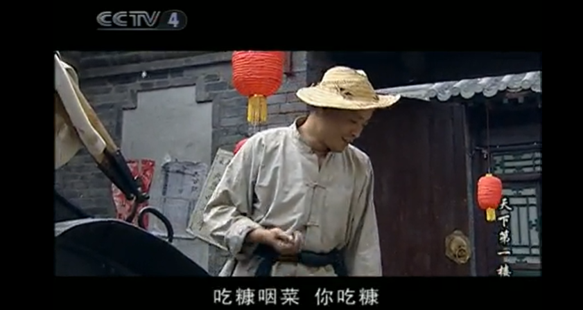

## 天下第一楼

记得天下第一楼的卢孟实对拉车车夫说：不要羡慕别人吃什么穿什么，靠自己的努力吃糠咽菜也是踏实的，而卢孟实走后，车夫朝着卢孟实远去的方向说：你咋不吃糠咽菜（大致意思）。挺可笑的一幕，知道自己的境遇，却不愿意吃苦努力，何时才能改变自己的生活。而我觉得卢孟实也犯了一个错误，那就是：不可与直言而与直言，失言。

## 常与同好争高下

工作生活中会遇到很多躺平的人，唯一能做的就是不要加入他们，保持内省，做到常与同好争高下，不与傻瓜论短长，否则必然会给自身带来很多的烦恼

## 内卷

内卷一词是被滥用的一个词，排除争比现在，大多是不想多、想躺平，但又迫于其他同学不得不学，被动去学

## 孙子兵法

求其上，得其中，求其中，得其下，求其下，必败

## 雄狮

雄性动物都应该有雄狮的觉悟，打一片天下或者死亡

## 自省

无关他人，无关环境。要做的就是安排好自己
