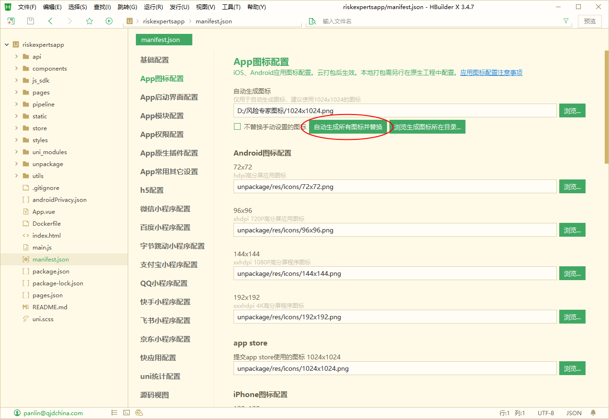
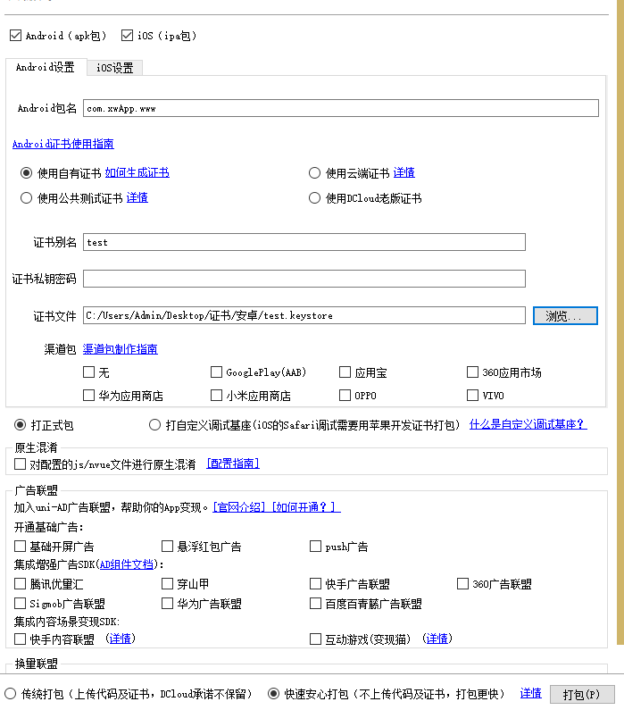
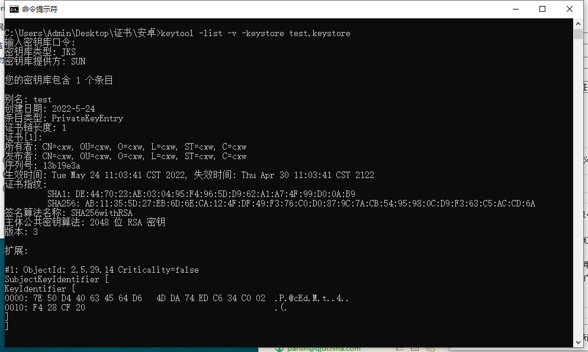
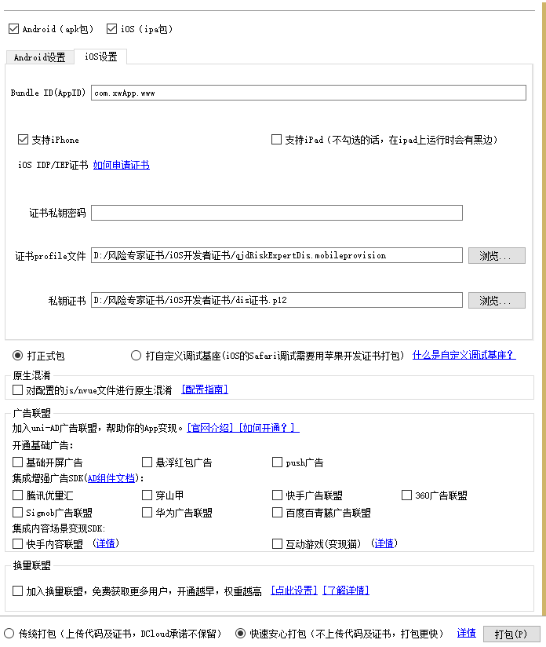
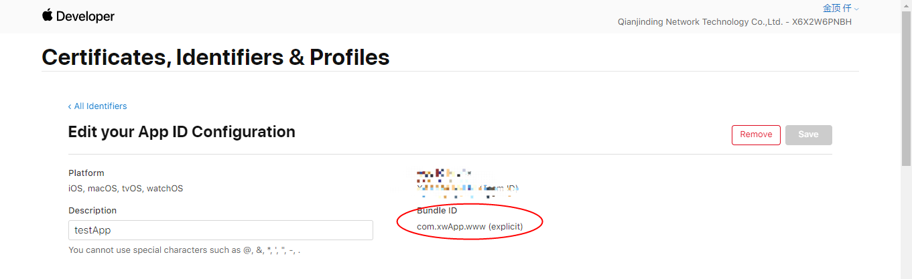
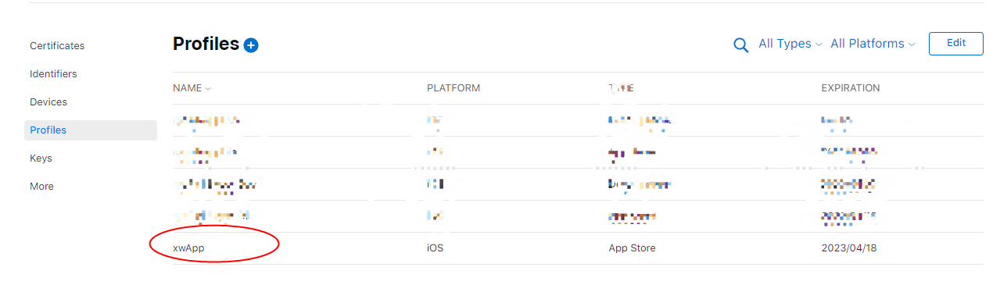

## 前言

前段时间用```uniapp```开发```app```，记录一下```android```和```ios```的打包过程

## uniapp

### 账号

首先，我们需要准备一个[DCloud](https://dev.dcloud.net.cn/)开发者账号，没有的自行前往注册一个

## 登录

使用注册的账号登录```HBuildex```，创建一个新项目，[DCloud](https://dev.dcloud.net.cn/)开发者平台会自动分配一个新项目，```manifest.json```中的```appID```即开发者平台上的```App id```

### 配置manifest.json

进入```manifest.json```进行配置

1. 基础配置

* uni-app应用标识

即```Dcloud```开发者平台应用的的```App id```

* 应用名词

填写app名称即可，例：测试app

* 应用描述

app相关信息描述

* 应用版本名称

即版本号

* Vue版本选择

选择开发对应的vue版本

2. App图标配置

提供一张1024 x 1024图片使用```uniapp```自带生成所有图片功能获取不同尺寸的图标，无需ui同学一一设计



3. App启动界面配置

静态的图片可以通过```uniapp```配置上传一张图片，动态启动页需要自行开发，方案很简单，开发一个新页面符合条件时再跳转页面，网上方案也很多，可以自行查询

4. App模块配置

```HBuildx```图形界面有很多功能选项，需要的勾选，不需要的不要勾选，避免包过大的问题

5. APP权限配置

有些权限再模块配置的时候会自动勾选上，有些部分不会，可以自行查询文档选择需要的权限

6. h5配置

h5配置一般为本地开发的时候需要，```HBuildx```图形界面配置较为简单，更复杂的配置如代理等需要到源码视图中进行配置

7. 源码视图

源码视图包含```uniapp```所有的配置，详细参考[配置](https://uniapp.dcloud.net.cn/collocation/manifest.html)

## 云打包

基本完成上述配置就可以开始进行云打包

### android打包



上图配置是一份安卓打包配置，稍作解释

* Android包名：按规则填写包名
* 证书别名：申请```android```证书时起的别名，如下图
* 证书私钥密码：申请证书时填写的密码
* 证书文件：申请的安卓证书

下图一份安卓证书信息，可以看到证书别名和```sha1```签名



### ios打包



上图配置是一份ios打包配置，稍作解释

* Bundle Id: 在苹果开发者平台创建应用时填写的```BundleId```



* 证书私钥密码: 申请证书时输入的密码
* 证书profile文件：苹果开发者平台申请的```profile```文件



* 私钥证书： 苹果开发者平台申请的私钥证书

## 证书申请

### android证书

参考```uniapp```提供的[证书申请流程](https://ask.dcloud.net.cn/article/35777)，更详细，这里只罗列大概流程

1. 安装JRE

[下载地址](https://www.java.com/zh-CN/download/)

2. 设置环境变量

根据安装目录自行设置

```
set PATH=%PATH%;"C:\Program Files\Java\jre1.8.0_333\bin"
```

3. 生成证书

过程会填写一些信息，正常填写即可

```
keytool -genkey -alias testalias -keyalg RSA -keysize 2048 -validity 36500 -keystore test.keystore
```

* testalias是证书别名，可修改为自己想设置的字符，建议使用英文字母和数字
* test.keystore是证书文件名称，可修改为自己想设置的文件名称，也可以指定完整文件路径
* 36500是证书的有效期，表示100年有效期，单位天，建议时间设置长一点，避免证书过期

3. 查看证书信息

```
keytool -list -v -keystore test.keystore  
```

信息如下：


### ios证书

参考```uniapp```提供的[证书申请流程](https://ask.dcloud.net.cn/article/152)，很详细，操作了一下，需要成为评估开发者，然后就可以登录开发者平台，按照流程就可以，但是申请证书文件需要```mac```的钥匙串，需要有个```mac```本本，我没有0.0，这部分没有实际操作过，也就不误人子弟了，后续有了在补充

## 结语

安排好自我
