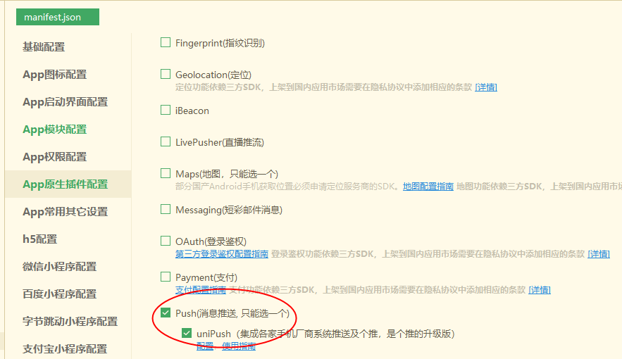
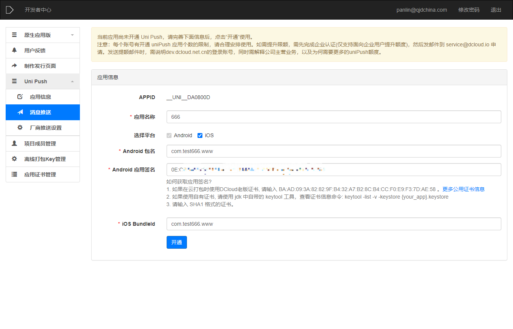
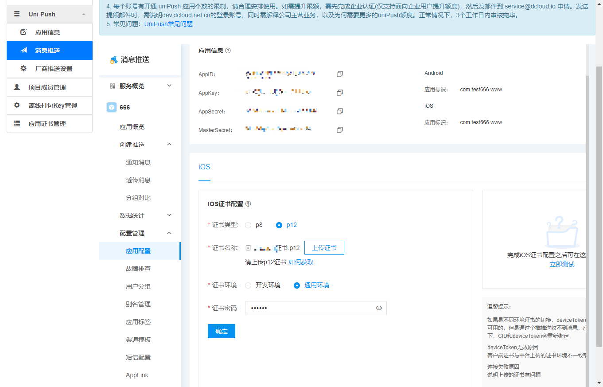

## 前言

前段做```app```，有个消息推送的功能，使用的是```uni-app```，由于```uni-app```已经集成了各手机厂家和个推的消息推送，所以做起来也相当的方便，```app```上线后又回头看一下这个功能，顺便记录一下

详细参考[UniPush开通指南](https://ask.dcloud.net.cn/article/35716)

## uni配置

首先需要在```manifest.json```中勾选```Push```功能



## 开发者平台

然后，进入[DCloud](https://dev.dcloud.net.cn/)开发者平台，点击项目进入```Uni Push```页面，首次进入需要先开通服务



* Android 包名：要和云打包时的保持一致

* Android 应用签名：```Android```证书信息中的```sha1```证书指纹

* iOS BundleId：即苹果开发者平台创建应用时的```BundleId```

开通成功后，进入```消息推送 => 配置管理 => 应用配置```



* 证书类型： 选择p12

* 证书名字： 在苹果开发者平台申请的开通了消息推送功能的p12证书

* 证书环境：选择自己对应的环境

* 证书密码：填写证书的密码

点击确定保存成功后，消息推送的功能就完成了，之后把```AppSecret```等信息提供给后端同学即可

## 结语

```uni-app```等跨端平台功能完善了，业务开发相对容易了很多
