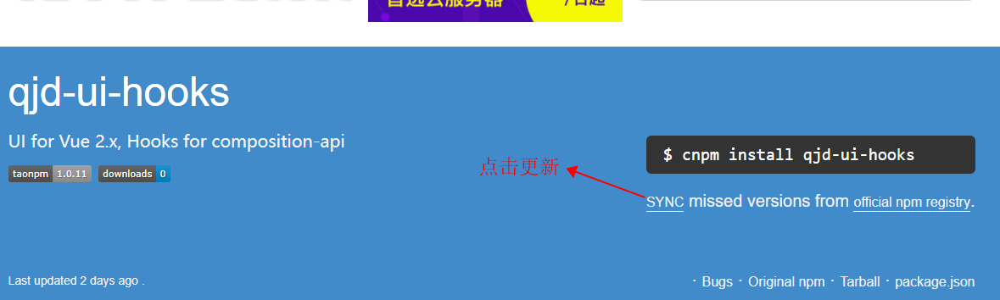

## 前言

之前包一直发布在```npm```上，公司搞了私有仓库后发布时发现找不到对应版本，牵扯出了一系列问题及排查问题方案

## npm源

查看当前```npm```源命令如下

```js
npm get registry
```

设置源命令如下

```js
npm set registry https://xxxxx
```

命令比较简单，但对于频繁切换源这种方式较为麻烦，而且源地址不容易记忆，这就引出了管理源的主角```nrm```

## nrm

安装```nrm```

```js
npm install -g nrm
```

查看源

```js
$ nrm ls

  npm ---------- https://registry.npmjs.org/
  yarn --------- https://registry.yarnpkg.com/
  tencent ------ https://mirrors.cloud.tencent.com/npm/
  cnpm --------- https://r.cnpmjs.org/
  taobao ------- https://registry.npmmirror.com/
  npmMirror ---- https://skimdb.npmjs.com/registry/

```

添加源

```js
 nrm add test https://test.com
```

切换源

```js
nrm use test
```

删除源

```js
nrm del test
```

使用```nrm```切换源变得非常容易

## cnpm同步资源

```npm```发包完成并不会立即同步到```淘宝源```，此时通过```淘宝源```无法安装插件。

公司私有仓库映射的是```淘宝源```，所以发布```npm```完成后需要手动更新一次```淘宝源```插件，在[淘宝源](https://npmmirror.com/?spm=a2c6h.24755359.0.0.2a9970b5DqkuOf)查询需要更新的插件，如```qjd-ui-hooks```，点击页面```SYNC```按钮即可，如下



更新完成如下


此时在通过```淘宝源```可安装插件

## 登录私有仓库

登录私有仓库和登录```npm```一样

```js
$ npm login
Username: fe
Password: 123456
Email: (this IS public) xxxxxx@xxxx.com
npm ERR! code E401
npm ERR! 401 Unauthorized - PUT xxxxxxx-/user/org.couchdb.user:fe
```

报错提示无权限，经查询删除```.npmrc```文件中私有源对应的```_authToken```即可，但多次尝试并没有作用


后找同事电脑多次尝试，有的可以登录有的不可以。后来大佬给我装了```docker```，弄了两个容器，```node```版本一个是```12.22.8```一个是```16.16.0```，发现高版本的可以登录，低版本无法登录，至此可以确定问题是```node```版本的问题


这里又有另外一个问题高版本```node```之前尝试前端工程安装失败，所以安装了低版本```node```，但发包到私有仓库又需要高版本，虽然大佬给我提供了```docker```，但终究使用不便（需加强docker的学习），所以使用另外一种方案处理```node```版本的问题：```nvm```


## nvm

```nvm```可以像```nrm```一样随意切换```node```版本

### 安装

1. 打开[链接](https://github.com/coreybutler/nvm-windows/releases) ，下载 ```nvm-setup.zip```
2. 若安装了```node```，请提前卸载
3. 安装```nvm-setup.zip```解压后的应用

```js
$ nvm -v
1.1.10
```

看到版本号表示安装成功

### 使用

安装不同版本```node```

```js
nvm install 12.22.8
nvm install 16.16.0
```

使用某个版本```node```

```js
nvm use 16.16.0
```

查看所以版本```node```

```js
$ nvm ls

  * 16.16.0 (Currently using 64-bit executable)
    12.22.8
```

切换不同版本要注意的是环境不同，不同环境安装过的插件需要重新安装，如在```12.22.8```安装了```nrm```,切换到```16.16.0```需要重新安装```nrm```

切到高版本```node```后重新登录

```js
$ npm login
npm WARN config global `--global`, `--local` are deprecated. Use `--location=global` instead.
npm notice Log in on https://xxx.xxxx.com/xxx/xxx/xx-xx/
Username: fe
Password: 123456
Email: (this IS public) xxxxxx@xxxxx.com
Logged in as fe on https://xxx.xxxx.com/xxx/xxx/xx-xx/.
```

登录成功，执行```npm publish```发包即可


## 结语

测试源已经成功，坐等公司正式私有仓库支持publish
