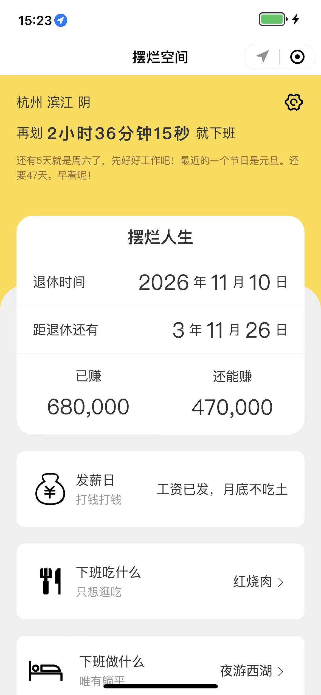
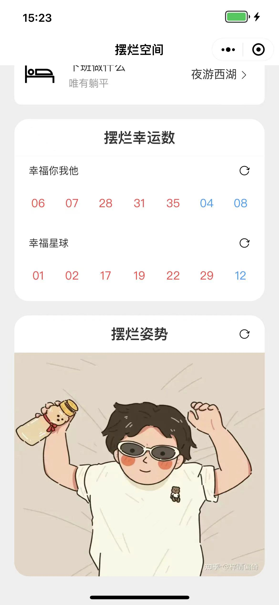
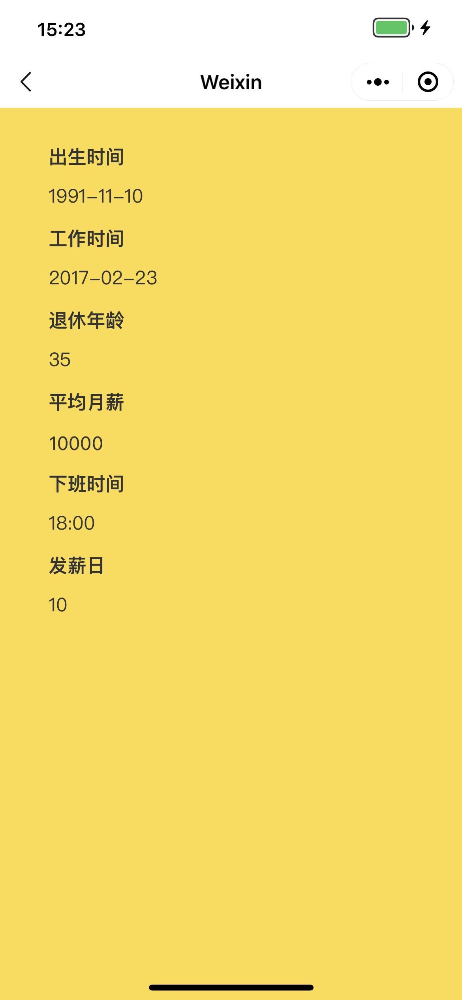

## 前言

不忙的时候就想做些东西，记得之前遇到过类似日记类的小程序，趁这次空闲做了个小程序《摆烂空间》







## 位置、天气

头部展示了位置和天气，```wx.getLocation```获取地理位置，上线前记得申请此```api```权限，拿到经纬度后可以调用[和风天气](https://id.qweather.com/#/homepage)接口查询城市、天气情况，如下

```js
wx.getLocation({
  type: 'wgs84',
  success(res) {
    const { latitude, longitude } = res ?? {}
    // 获取城市
    wx.request({
      url: `https://geoapi.qweather.com/v2/city/lookup?location=${longitude},${latitude}&key=${key}`,
      success: data => console.log(data)
      // {name: "滨江", id: "101210114", lat: "30.20661", lon: "120.21061", adm2: "杭州", …}
    })
    // 获取天气
    wx.request({
      url: `https://devapi.qweather.com/v7/weather/now?location=${longitude},${latitude}&key=${key}`,
      success: data => console.log(data)
      // now: {obsTime: "2022-11-14T14:55+08:00", temp: "12", feelsLike: "9", icon: "104", text: "阴", …}
    })
  },
  fail(error) {
    console.warn('error: ', error)
  }
})
```

## 下班倒计时、节日

下班倒计时不多说，写个定时器即可。周末、法定节假日调用找到的免费接口，获取当天信息如下(都是免费接口，最喜欢白嫖了)

```js
wx.request({
  url: `https://timor.tech/api/holiday/info/${year}-${month}-${day}`,
  success: ({ data }) => console.log(data)
  // type: {type: 0, name: "周一", week: 1} 0 表示工作日，1表示周末，2表示法定节假日
})
```

该接口返回```type```字段可以区分当天是工作日、周末还是法定节假日

另外一个接口可以提供一些趣味提示，如距离下个法定节假日的时间等等，该接口有缓存作用，常导致获取的信息不正确，所以加个随机```id```参数获取最新数据

```js
wx.request({
  url: `https://timor.tech/api/holiday/tts?id=${Math.random()}`,
  success: ({ data }) => console.log(data)
  // {code: 0, tts: "还有5天就是周六了，先好好工作吧！最近的一个节日是元旦。还要47天。早着呢！"}
})
```

## 摆烂人生

展示退休时间、距退休时间、收入、发薪日、随机下班吃什么做什么，可以通过设置初始化自己的个人信息

## 摆烂幸运数

自己经常买彩票，这里```大乐透```和```双色球```，但是敏感词无法过审，所以换了名字

## 摆烂姿势

网上看到过一些有意思的摆烂姿势，在这里加一个摆烂姿势模块


## 结语

云开发也收费了，所以很多数据是本地缓存，以后再也不能白嫖了。其实我觉得可以添加一些房贷车贷等模块，计算出道退休时能否真正摆烂，然后再给一些趣味提示，或者做一些休闲小游戏，摆烂日记等等模块。感兴趣小伙伴可以喊我一起做事情


