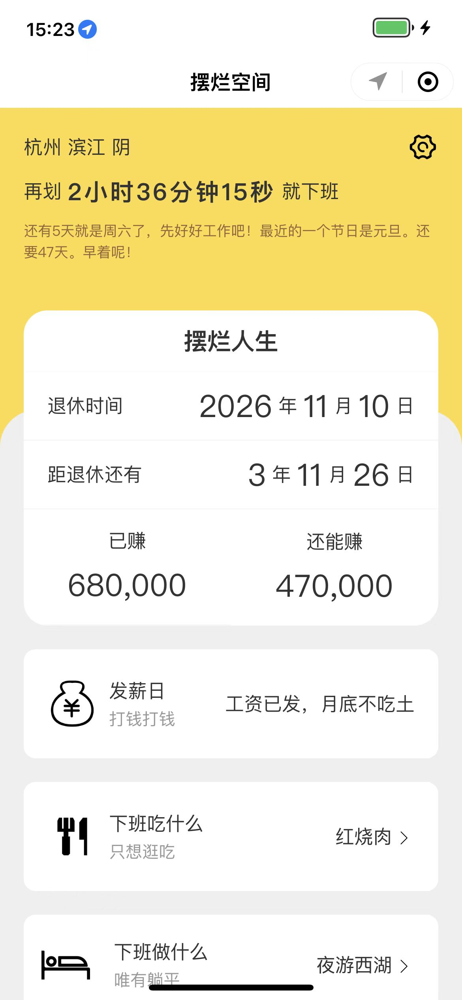

## 前言


之前空闲的时候开发了摆烂空间，发布了反映还不错，朋友就帮我重新设计了首页ui部分，逼格一下子就上来了，先给大家看一下之前的旧版



这样看还不错，但是没对比就没有伤害啊，看一下新版的


这样子看逼格一下子就上来了，这里特别感谢朋友的帮助

除了首页摆烂区，添加了一个休闲区（先自己尝试一下），目前有两个模块功能：挑战10s、行走的字幕

## 挑战10s

这个功能是之前在逛商场的时候看到的一个线下玩法，挑战者按下按钮，如果刚好停在10s则表示成功，否则失败，成功的话商家会提供一些礼品，然后自己也想做点东西，就把这个搬到休闲区了，效果如下


## 行走的字幕

行走的字幕其实就是滚动弹幕，最初看到的时候是看比赛的时候看到小姐姐拿着pad，上边滚动播放着喜欢选手的名字，感觉蛮有意思的，后来看到已经有这样的小程序，但这并不能阻止我的热情，还是毅然决然的去实现并把它也扔到了休闲区，看下效果吧


这两个功能，朋友没有帮我设计，ui部分勉勉强强

## 技术难点

### 摆烂区切换文案有残留

摆烂区```做什么```和```吃什么```两个模块使用的定时器快速切换文案，但切换快的时候```ios```上会看到之前文案的残留，网上查找了一下并没有发现合适的办法，即使把时间调为```1s```更新一次还是会有残留，感谢有解决方案的同学帮忙解答一下

### input框点击穿透

行走字幕那里的```input```是浮动的，点击的时候会触发下方元素的点击事件，网上找的方案要么不合适要么无法解决问题，经过尝试，给```input```及其父级添加```catchtap```事件可以避免触发下方元素的点击事件

### 分享后navigateBack无法返回

分享后```navigateBack```无法返回，改为```reLaunch```回到页面(比较粗暴，根据自己场景选择合适方案)

### setInterval/setTimeout

无论是```setInterval```还是```setTimeout```做动画都不够友好，小程序不支持```requestAnimationFrame```，```canvas```可以使用，但是场景没必要使用```canvas```，所以做出来的动画感觉有卡顿，大佬们都是用的哪些方案，感谢赐教

## 结语

休闲区功能会越来越多，有什么有意思的功能也可以提供给我，我来实现，您只管体验，哈哈！感谢大家的体验，搞事情的小伙伴联系我哦！！！
