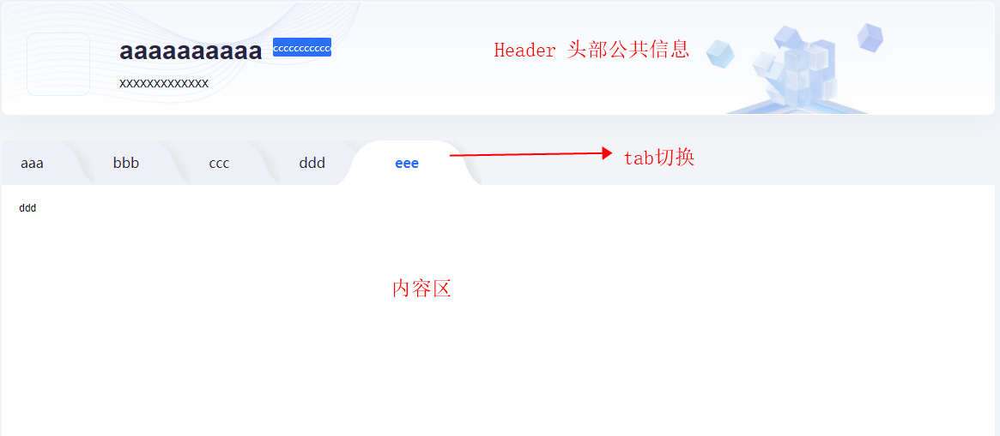

## 前言

之前分享过两篇关于```EffectScope```的文章：[vue3之effectScope强大功能](https://chasejourney.top/chJouBlog/2022/09/09/effecfscope/)和[vue3源码之旅-effectScope](https://chasejourney.top/chJouBlog/2022/09/13/vue3-effectscope/)，一篇介绍了```EffectScope```的具体使用，另一篇是```EffectScope```的源码分析，但未免都相对干燥，最近业务遇到了比较有意思的需求，实现这个需求的过程也再次体现了```EffectScope```的优秀

## 场景



如上图，功能大致如下：

1. 这是个详情页，通过详情```id```获取各项数据
1. header公共区域数据通过调用接口获取数据
2. tab区域通过接口获取动态数据
3. 点击tab切换内容区

由于其他模块会跳转tab指定模块，所以tab切换时对应```id```携带在```url```上，地址如下

```js
// url
const url = `https://localhost:8080/detail?tab=${id}`
```

由于```id```是动态的，所以```tab```切换时，地址会变化，页面会初始化，```tab```和```header```区域每次都会触发接口更新数据，这里就会导致一些性能和体验问题

1. 对于```header```区域是公共部分，实际无需更新数据（对服务资源浪费）
2. 从外部进入该模块后```tab```区域数据也应固定下来，无需数据更新（对服务资源浪费）
3. ```tab```切换时```header```区域每次会```loading```、```tab```区域会因为重新请求数据导致高度塌陷（体验较差）


针对以上问题，毫无疑问我们希望只有两个时机触发```header```和```tab```区域的数据更新

1. 主动更新（如从外部进入时、详情id发生变化时）
2. ```tab```页面自行刷新

## 方案

so，最理想的方案就是找到一种只会在初始化的时候更新且在我们需要更新他的时候去更新

### 方案一

为实现以上内容，最容易想到的就是```store```，但单单用```store```显然无法同时满足```外部进入更新一次```、```内部tab切换不更新（因为```url```挂载了动态```id```）```、```当前tab页刷新时更新```的问题，所以这时可能有同学会想到添加缓存，但何时清楚缓存是个复杂问题，不但要考虑接口还需要考虑路由信息，甚至要到```全局路由守卫```里做一些操作，这显然不是我们想要的方案

### 方案二

鉴于```effectScope```的特性：当前作用域执行一次，并可以自定义更新数据方式，所以其便是实现这个需求的最佳方案

1. 外部初始化时触发一次，主动更新数据，进入```tab```页便不会再次触发
2. ```tab```页刷新时触发```tab```页初始化更新数据
3. ```tab```切换时没有主动触发不会更新数据

以上3点听起来可能比较抽象，看一下具体实现

## 实现

### 改造useGlobalState

由于参数是动态的，所以需要对原来```useGlobalState```进行一些改造，提供自定义参数，改造后如下

```js
// useGlobalState
import { effectScope } from '@vue/composition-api'

export default run => {
  let isChange = false
  let state
  const scope = effectScope(true)
  return params => { // 添加自定义参数
    // 防止重复触发
    if (!isChange) {
      state = scope.run(() => run(params))
      isChange = true
    }
    return state
  }
}
```

### 自定义useTab

```js
// useTab
import { computed } from '@vue/composition-api'
import useGlobalState from '../useGlobalState'
import ajaxStore from '@/apis'
import useAsync from 'hooks/useAsync'

export default useGlobalState(
  // init 开关，表示是否初始化调用接口
  // 非tab此开关是关闭的，只有tab页刷新时才需要初始化调用接口
  ({ id, init = false } = {}) => {
    // ajaxStore
    const { xxx } = ajaxStore
    // useAsync
    const { result, doResult, loading } = useAsync({ request: xxx, init: false })
    // computed
    const dataSource = computed(() => {
      // tabs数据
      const { configs } = result.value ?? {}
      return {
        configs
      }
    })
    // init
    init && doResult({ monitorCustomerId: id })

    return {
      loading,
      doResult,
      dataSource
    }
  }
)

```

### 使用

1. A页面有进入```tab```页入口

A页面相关代码如下

```js
// useTab
// 不传init，init默认false，不会初始化时调用接口，在此页面初始化后，进入tab页面便不会触发tab页的useTab初始化
const { doResult } = useTab() 
// 进入tab页动作
const click = async (row) => {
  await doResult({ id: row?.id }) // 获得到id后主动更新tab数据
  router.push({ name: 'tab', query: { id: row?.id } })
}
```

2. 进入tab页后 & tab页更新

```tab```页代码

```js
// useTab
// 开启init，若是刷新则触发接口调用更新数据，若是从A页面进入后非刷新不会触发数据更新
const { dataSource } = useTab({ id, init: true })
```

至此，代码演示结束

### 优化改进

若是到```tab```页的入口较多的话，例如有5个A页面，一个一个添加过于麻烦，我们将数据更新统一放在```tab```页面，优化后```tab```也代码如下

```js
// useTab
const { dataSource, refreshHandle } = useTab({ id, init: true })
// 监听路由守卫
$router.beforeEach((to, from, next) => {
  const { query: { id } } = to
  // 若进入tab页的来源不是tab页本身，则更新数据
  to.name === 'detail' && from.name !== 'detail' && refreshHandle(id)
  next()
})
```

对此做个解释，这里依然是利用```EffectScope```特性，无论从那个地方进入```tab```页初始化均会走```useTab```更新数据，但此时不会触发路由守卫，后续再次进入```tab```页，则会通过路由守卫判断主动更新数据，不会触发```useTab```初始化更新数据

改善更新数据方式后，无论有多少个入口，也不需要一遍一遍的去手动更新数据了

## 结语

除了之前```EffectScope```的一些强大功能，此次开发更能体现其对性能、体验、开发带来的优势


