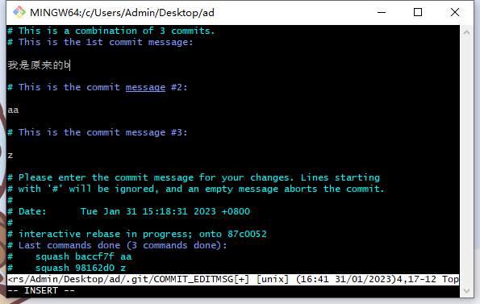

## 前言

新的一年，开启```2023```的第一篇。```git```命令很多，但平时用的最多的一定是下边几个

```
git init
git pull
git add .
git commit -m 'xx'
git push
```

没错，就是这几个命令帮助大家完成了工作，简单且亲切。但只会这几个命令难以应付工作的复杂度，如：

* 提交记录复杂且混乱怎么办
* 单个功能多次提交，其实只完成一个功能怎么办
* 只需要某个分支的某几次提交怎么办
* 强推代码覆盖掉丢失代码怎么办

so，了解更多的命令会让这些事情事半功倍

## cherry-pick

```cherry-pick```是一个非常实用的命令，他的作用就是可以将某次的提交记录合并到需要的分支去。

本司因为项目会存在好几个环境，常常切换完分支后忘记切回来，导致一些改动没有在需要的分支进行，这个时候就可以使用```cherry-pick```将需要的代码合并过来，比起手动操作```cherry-pick```简单且安全

```
git cherry-pick <commitHash>
```

## rebase

```rebase```命令相对较多，而且也需要有一定了解入手才好，不然会把队友心态搞崩的，```rebase```和```merge```的最终目的都是合并代码，但是考虑的维度不一样

* ```merge```简单无脑，有冲突处理就好，不会变基（其实就是不会改变提交记录的hash值），对新手及其友好，提交记录比较详细，但是提交记录也会相对混乱，不利于查找记录。复杂场景难以支持

* ```rebase```最主要的问题是会变基，多人合作时需要注意，提交记录便于后期维护查找，可以支持较多复杂场景

### 基础使用

```
git rebase <branch>
```

如果```branch```有新的提交，就会涉及到变基，变基就会导致提交记录即```hash```值的变化，如果这些变化的记录在变基前已经提交到远程，再次推送代码就要强推```git push --force```，强推代码也存在风险（推送前有新的提交），所以最好使用```git push --force-with-lease```

若是有冲突```rebase```会停止，解决完冲突后执行```git add .```后无需再次```commit```，执行```git rebase --continue```即可。建议不熟悉的同学先单独玩一下，了解清楚什么叫做变基

取消此次```rebase```，执行```git rebase --abort```

### 合并commit记录

```
git rebase -i HEAD~<num>
或者
git rebase -i <commitHash>
```

需要合并几次提交```num```填写几即可，常用来处理一个功能多次提交，且诸多提交毫无意义，如

```
asda3365 登录3
xczx3365 登录2
16cxc365 登录1
164fxcx1 注册3
164f3123 注册2
164f5456 注册1
```

这样的记录可以合并为```注册```和```登录```两条记录，此```vim```操作界面如下，将不需要的记录改为```s```（```suqash```表示将当前记录与上一个记录合并），```wq```保存后会弹出第二张图的界面，将```commit```信息改为自己能看懂的后保存即可




### onto

```
git rebase --onto <newparent> <oldparent>
```

```git rebase --onto```后可以接收三个参数，添加第三个参数时会生成新的分支，并指定```HEAD```的指向，没有相应的场景理解，所以我们先了解两个参数的情况。两个参数时第一个参数是新的父级，第二个是旧的父级，改变父级的指向，举两个栗子

#### 栗子一


如上图，在```feature2```分支上```rebase```到```master```即

```
git rebase master
```

之后提交记录便是```A-B-C-D'-F'-G'```，因为```D```是```feature2```和```feature1```的共同提交记录，若是不想存在```D```的记录则可以执行如下命令

```
git rebase --onto master feature1
```

之后提交记录便是```A-B-C-F'-G'```，改变```feature2```父级为```master```

#### 栗子二

目前有如下提交```a-b-c-d-e-f```

```
62d13c5 (HEAD -> master) f
49978ef e
e7bfae0 d
9b87061 c
2bded9a b
ef4f20d a
```

如果想删除```c```这条记录可以执行，其含义是将旧父级```c```更新为新的父级```b```

```
git rebase --onto 2bded9a 9b87061
```

而后提交记录变更为```a-b-d'-e'-f'```，```commitHash```从```d```开始变化，记录```c```消失

```
faec99a (HEAD -> master) f
61a8631 e
50cca8f d
2bded9a b
ef4f20d a
```

### pull --rebase

```
git pull 相当于 git fetch + git merge
git pull --rebase 相当于 git fetch + git rebase
```

## --force-with-lease

```rebase```那边也提到了强推代码，强推代码一直是不被推荐的，因为即使操作的再快也无法保证在提交之前有其他的提交，所以```git```提供了新的命令

```
git push --force-with-lease
```

此命令提交前会检查是否有新的提交，若有新的提交则会提交失败

注意```--force-with-lease```失败后再执行一次也会强制提交覆盖

## reset、revert

```reaset```和```revert```均可以用作版本回退，适用场景不同

* ```reaset```回退版本后会丢失该版本之后的提交记录，推送至远程时需要强推代码

有如下提交

```
5f21366 (HEAD -> master) d
a542921 c
795a7b0 b
4001e19 a
```

回退到```b```

```
git reset --hard 795a7b0
```

提交记录如下

```
795a7b0 (HEAD -> master) b
4001e19 a
```

* ```revert```反做版本后不会丢失提交记录，会产生新的反做记录

有如下提交

```
5f21366 (HEAD -> master) d
a542921 c
795a7b0 b
4001e19 a
```

反做提交记录```b```

```
git revert -n 795a7b0
有冲突，继续
git add .
git revert --continue
```

提交记录不会丢失

```
471cceb (HEAD -> master) Revert "b"
5f21366 d
a542921 c
795a7b0 b
4001e19 a
```

所以当版本只是临时切换时，```revert```比```reset```更合适

## stash

工作中常遇到开发了一部分需要到其他分支处理问题的情况，但本次改动又不足以提交，这个时候就需要```stash```暂存代码，等问题处理完毕在切回来继续开发，涉及到的命令如下

```
git stash // 暂存
git stash save "message" // 暂存 + 备注
git stash pop // 应用最近一次暂存的修改，并删除暂存的记录
git stash apply  // 应用某个存储， git stash apply stash@{$num} ，num默认为0
git stash list // 查看所所有暂存
git stash clear // 删除所有暂存
```

## merge

合并分支，并将分支上的提交合并成一次提交，合并过来后续通过```git add .```和```git commit -m 'xx'```重新提交代码

```
git merge <branch> --squash
```

## commit

```commit```信息填写有误可以通过以下命令修改

```
git commit --amend
```

## 结语

多操作有助于理解

