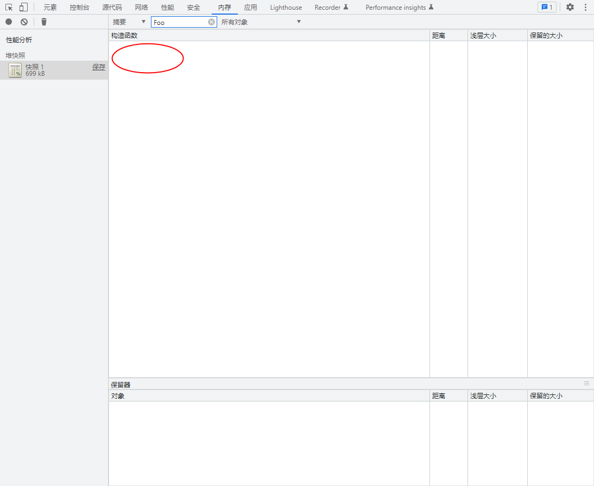
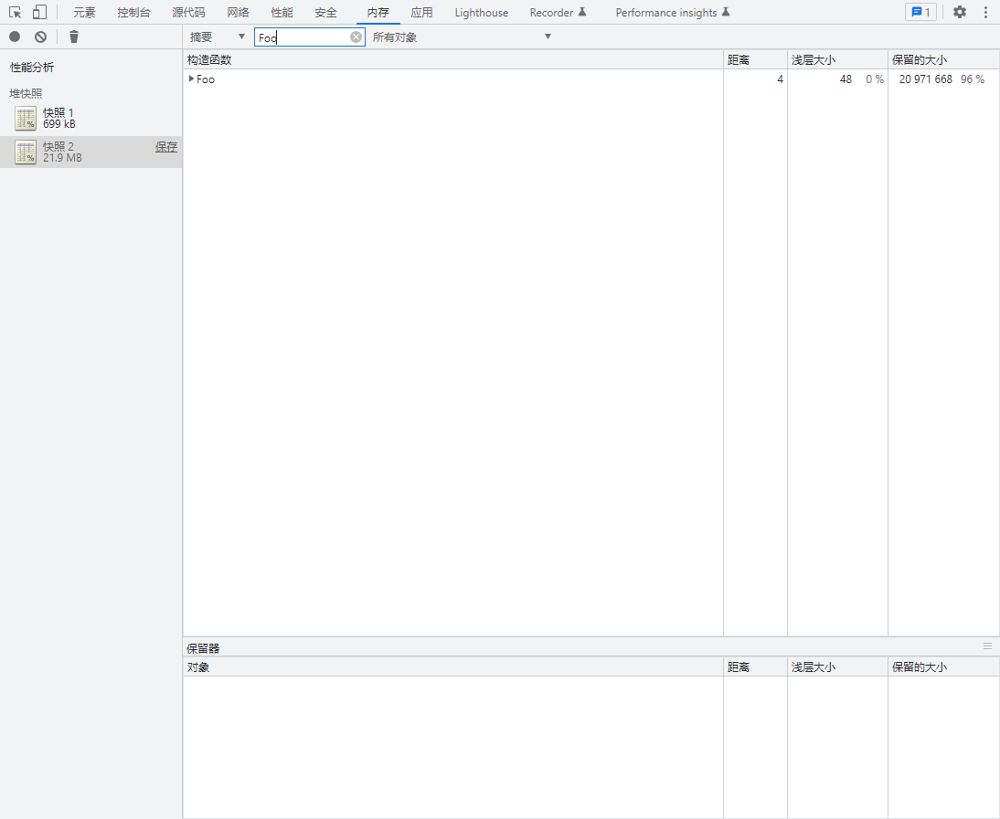

## 前言

聊一下```WeakMap```弱引用，看了写文章发现很多说的不对，给出的```demo```经过尝试也是错误的，哎，难搞也要搞

## 弱引用 vs 强引用

对象被强引用则不会被垃圾回收机制回收，这没啥说的。那到底啥事弱引用呢？

垃圾回收机制最常用的方法就是引用计数，只要有引用堆内存的地方，引用计数就要加1。如果一个值的引用次数是0，就表示这个值不再用到了，因此可以将这块内存释放

弱引用则可以理解为引用计数不会+1，看一下实际表现

## Map vs WeakMap

```js
var m = new WeakMap()
function Foo() {
  this.arr = new Array(5 * 1024 * 1024)
}
var f = new Foo()
m.set(f, 'data')
f = null
```

网上有人说```m.get('f')```等到的是```undefined```所以是弱引用，但其实你使用```Map```得到的也是```undefined```，这种说法还非常的多，不能说他说的不对吧，简直就是胡说八道。

回归正传，看一下为啥说```WeakMap```是弱引用。打开```F12```，选择```内存(memory)```，点击小圆点获取快照，然后搜索```Foo```，发现并没有表示其已经被回收



而后将```WeakMap```改为```Map```重新获取快照，发现```Foo```没有被回收



这个方式可以很直观的表明```WeakMap```的弱引用


